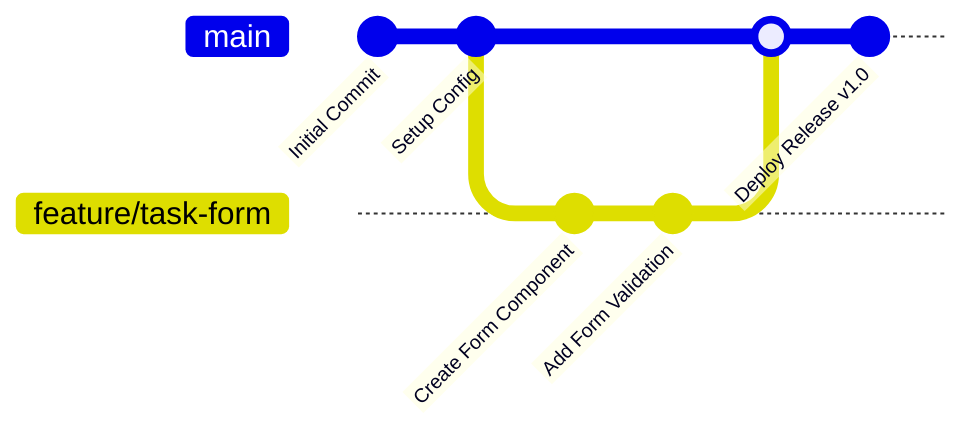

# Week 1: Full Technical Documentation

## Intern Career Path — Web Development
- **Portal ID:** ICP-2AA73905-2026
- **Repository:** ICP-2AA73905-2026-REPO
- **Internship Track:** Web Development Self-Learning Program
- **Module:** Week 1 — Environment Setup, Git Workflows & Project Selection
- **Operating System:** Windows 11 / Windows OS

---

## Table of Contents

1. [Executive Summary & Week 1 Objectives](#1-executive-summary--week-1-objectives)
2. [Web Development Ecosystem & Core Concepts](#2-web-development-ecosystem--core-concepts)
   - [2.1 Client-Server Architecture](#21-client-server-architecture)
   - [2.2 HTTP/HTTPS Protocol & Status Codes](#22-httphttps-protocol--status-codes)
   - [2.3 Browser Rendering Pipeline](#23-browser-rendering-pipeline)
   - [2.4 Core Frontend Technologies (HTML5, CSS3, ES6+)](#24-core-frontend-technologies-html5-css3-es6)
3. [Development Environment Setup & Verification](#3-development-environment-setup--verification)
   - [3.1 Tooling Overview](#31-tooling-overview)
   - [3.2 Windows Terminal & Shell Configuration](#32-windows-terminal--shell-configuration)
   - [3.3 Node.js & NPM Installation](#33-nodejs--npm-installation)
   - [3.4 IDE & Essential VS Code Extensions](#34-ide--essential-vs-code-extensions)
   - [3.5 Git Configuration & SSH Authentication](#35-git-configuration--ssh-authentication)
   - [3.6 Windows-Specific Git Settings (Line Endings & Paths)](#36-windows-specific-git-settings-line-endings--paths)
4. [Command-Line & Git Quick Reference](#4-command-line--git-quick-reference)
   - [4.1 PowerShell vs. Git Bash Commands](#41-powershell-vs-git-bash-commands)
   - [4.2 Core Git Command Reference](#42-core-git-command-reference)
   - [4.3 NPM Lifecycle Commands](#43-npm-lifecycle-commands)
5. [Git Branching Strategy & Collaboration Workflows](#5-git-branching-strategy--collaboration-workflows)
   - [5.1 Branch Naming Conventions](#51-branch-naming-conventions)
   - [5.2 Step-by-Step Feature Branching Workflow](#52-step-by-step-feature-branching-workflow)
   - [5.3 Commit Message Standards & Hygiene](#53-commit-message-standards--hygiene)
6. [Advanced Git Operations & Conflict Resolution](#6-advanced-git-operations--conflict-resolution)
   - [6.1 Git Stash Workflow](#61-git-stash-workflow)
   - [6.2 Git Merge vs. Git Rebase](#62-git-merge-vs-git-rebase)
   - [6.3 Resolving Merge Conflicts](#63-resolving-merge-conflicts)
   - [6.4 Undoing Changes Safely](#64-undoing-changes-safely)
7. [Project Selection & 6-Week Roadmap](#7-project-selection--6-week-roadmap)
   - [7.1 Project Selection Overview](#71-project-selection-overview)
   - [7.2 Project 1: Task Management Application](#72-project-1-task-management-application)
   - [7.3 Project 2: Weather Dashboard Application](#73-project-2-weather-dashboard-application)
   - [7.4 Selection Rationale & Synergies](#74-selection-rationale--synergies)
   - [7.5 6-Week Milestone Timeline](#75-6-week-milestone-timeline)
8. [Deliverables & Verification Summary](#8-deliverables--verification-summary)

---

## 1. Executive Summary & Week 1 Objectives

Week 1 serves as the technical foundation for the 6-week self-learning web development internship. It establishes a resilient local development environment on Windows, establishes strict version control protocols using Git and GitHub, provides a deep conceptual review of the web ecosystem, and outlines the scope, milestones, and architectural requirements for two primary capstone projects.

### Key Milestones Achieved:
1. **Configured Windows Development Environment:** Installed and validated Git, Node.js (LTS), NPM, and modern IDE tooling with productivity extensions.
2. **Standardized Version Control Workflows:** Mastered Git branching (`feature/*`), clean commit conventions, merge conflict resolution, and SSH authentication.
3. **Selected & Scoped Capstone Projects:** Formulated detailed roadmaps for the **Task Management Application** and **Weather Dashboard Application**.
4. **Authored Technical Documentation:** Created structured notes and reference manuals inside the `Week1/` workspace.

---

## 2. Web Development Ecosystem & Core Concepts

### 2.1 Client-Server Architecture

Modern web applications operate on a distributed client-server model:

```
┌─────────────────────────────────────────┐
│              Client (Frontend)          │
│  - Web Browser (Chrome, Edge, Firefox)  │
│  - HTML5 (Structure)                    │
│  - CSS3 (Styling & Layout)              │
│  - JavaScript (Logic & Interactivity)   │
└───────────────────┬─────────────────────┘
                    │ HTTPS Requests (GET, POST, PUT, DELETE)
                    │ Response (JSON, HTML, Assets)
                    ▼
┌─────────────────────────────────────────┐
│              Server (Backend)           │
│  - Runtime: Node.js / Express           │
│  - Business Logic & API Routing         │
│  - Authentication & Authorization       │
└───────────────────┬─────────────────────┘
                    │ Queries / Mutations
                    ▼
┌─────────────────────────────────────────┐
│              Database Layer             │
│  - Document / Relational Stores         │
│  - MongoDB / PostgreSQL                 │
└─────────────────────────────────────────┘
```

- **Client (Frontend):** Executes within the user's browser, handling the user interface (UI), state presentation, event handling, and sending network requests.
- **Server (Backend):** Listens for incoming HTTP requests, processes business logic, verifies authentication tokens, enforces validation rules, and queries databases.
- **Database:** Stores persistent records across application sessions.

---

### 2.2 HTTP/HTTPS Protocol & Status Codes

Web communication is governed by the Hypertext Transfer Protocol (HTTP/HTTPS).

#### Core HTTP Methods (RESTful API Standards):
- `GET`: Retrieve resources from the server without causing side effects.
- `POST`: Submit data to create a new resource on the server.
- `PUT`: Replace an entire resource with new data.
- `PATCH`: Partially update an existing resource.
- `DELETE`: Remove a resource from the server.

#### Standard HTTP Status Code Categories:

| Code Range | Category | Common Examples |
| :--- | :--- | :--- |
| **`2xx`** | **Success** | `200 OK` (Standard success), `201 Created` (Resource created), `204 No Content` (Success with empty body) |
| **`3xx`** | **Redirection** | `301 Moved Permanently`, `304 Not Modified` (Cached response) |
| **`4xx`** | **Client Error** | `400 Bad Request` (Validation error), `401 Unauthorized` (Unauthenticated), `403 Forbidden` (Insufficient permissions), `404 Not Found` (Missing resource), `429 Too Many Requests` (Rate limit hit) |
| **`5xx`** | **Server Error** | `500 Internal Server Error` (Unhandled exception), `502 Bad Gateway`, `503 Service Unavailable` |

---

### 2.3 Browser Rendering Pipeline

When a browser receives an HTML document, it follows a structured pipeline to paint pixels to the screen:

```
HTML Parsing  ──►  DOM Tree   ──┐
                                ├──►  Render Tree  ──►  Layout  ──►  Paint  ──►  Composite
CSS Parsing   ──►  CSSOM Tree ──┘
```

1. **DOM Tree Construction:** The HTML parser converts raw bytes into characters, tokens, nodes, and finally builds the **Document Object Model (DOM)**.
2. **CSSOM Tree Construction:** The CSS parser processes stylesheet rules to build the **CSS Object Model (CSSOM)**.
3. **Render Tree Generation:** The browser combines visible DOM nodes with CSSOM style rules to create the Render Tree (nodes with `display: none` are excluded).
4. **Layout (Reflow):** The browser calculates the exact geometry, position, and dimensions of every visible element.
5. **Painting (Repaint):** The browser fills in pixels (colors, borders, shadows, text, images) across visual layers.
6. **Compositing:** Distinct layers are combined and rendered onto the screen GPU buffer.

---

### 2.4 Core Frontend Technologies (HTML5, CSS3, ES6+)

#### 1. HTML5 (Semantic Structure)
HTML5 introduces semantic elements that provide accessibility, SEO advantages, and maintainable document structure:
- Structural elements: `<header>`, `<nav>`, `<main>`, `<section>`, `<article>`, `<aside>`, `<footer>`.
- Interactive elements: `<dialog>`, `<form>`, `<input>`, `<button>`, `<details>`, `<summary>`.

#### 2. CSS3 (Styling & Layout Engines)
- **The Box Model:** Every element consists of `content` $\rightarrow$ `padding` $\rightarrow$ `border` $\rightarrow$ `margin`. The property `box-sizing: border-box` ensures padding and border are included in total width/height.
- **Flexbox (1D Layouts):** Ideal for aligning items along a single axis (row or column), distributing space dynamically with properties like `justify-content`, `align-items`, and `gap`.
- **CSS Grid (2D Layouts):** Ideal for dual-axis layout systems (columns and rows), using template definitions (`grid-template-columns: repeat(auto-fit, minmax(280px, 1fr))`).

#### 3. Modern JavaScript (ES6+)
- **Scope & Variables:** Block-scoped `const` (immutable binding) and `let` (mutable), replacing legacy `var`.
- **Arrow Functions:** Terse syntax with lexical `this` binding (`const add = (a, b) => a + b`).
- **Destructuring & Spread/Rest:** Object and array unpacking (`const { id, title } = task; const updated = { ...task, completed: true };`).
- **Asynchronous Programming:** `Promise` chains and `async`/`await` for readable, non-blocking asynchronous operations.
- **Web Storage APIs:** `localStorage` (persistent key-value storage) and `sessionStorage` (session-lifetime storage).

---

## 3. Development Environment Setup & Verification

### 3.1 Tooling Overview

The workstation environment was configured with the following toolchain:
- **Operating System:** Windows 11 (64-bit)
- **Runtime:** Node.js LTS (v20+ / v22+) & NPM
- **Version Control:** Git for Windows (v2.40+) with Git Bash & PowerShell
- **Code Editor:** VS Code / Antigravity IDE
- **Terminal Shell:** PowerShell 7 / Git Bash

---

### 3.2 Windows Terminal & Shell Configuration

Both Windows PowerShell and Git Bash are configured for development tasks. PowerShell is utilized for Windows-native scripts and Node package execution, while Git Bash provides POSIX-compliant Unix tooling (`grep`, `awk`, `find`, `ssh`).

---

### 3.3 Node.js & NPM Installation

Node.js provides the JavaScript execution runtime outside the browser, while NPM manages third-party libraries and scripts.

#### Installation Verification:
```powershell
# Verify Node.js runtime version
node -v
# Output: v20.x.x (or LTS version)

# Verify NPM package manager version
npm -v
# Output: 10.x.x
```

---

### 3.4 IDE & Essential VS Code Extensions

The IDE was configured with the following core extensions:
- **Prettier - Code Formatter:** Automated code formatting on file save.
- **ESLint:** Real-time linting and syntax error detection for JavaScript.
- **GitLens:** Inline Git blame, branch visualization, and commit history exploration.
- **Live Server:** Local development HTTP server with live-reloading.
- **Path Intellisense:** Autocompletes filenames and relative paths in imports.

---

### 3.5 Git Configuration & SSH Authentication

#### Global Git Identification:
```powershell
git config --global user.name "Your Name"
git config --global user.email "your.email@example.com"
git config --global init.defaultBranch main
```

#### Generating & Configuring SSH Keys:
Using Ed25519 cryptography for secure, passwordless authentication with GitHub:
```powershell
# 1. Generate SSH key pair
ssh-keygen -t ed25519 -C "your.email@example.com"

# 2. Copy the public key to Windows clipboard
clip < ~/.ssh/id_ed25519.pub

# 3. Test SSH connection to GitHub
ssh -T git@github.com
# Expected response: "Hi <username>! You've successfully authenticated..."
```

---

### 3.6 Windows-Specific Git Settings (Line Endings & Paths)

Windows and Unix systems handle line endings differently (Windows uses `CRLF` `\r\n`, whereas Linux/macOS uses `LF` `\n`). To prevent entire files from appearing modified due to line-ending conversions:

```powershell
# Auto-convert CRLF to LF on commit, LF to CRLF on checkout
git config --global core.autocrlf true

# Enable long file path support in Windows Git (> 260 characters)
git config --global core.longpaths true

# Use Windows Credential Manager for secure credential storage
git config --global credential.helper manager
```

---

## 4. Command-Line & Git Quick Reference

### 4.1 PowerShell vs. Git Bash Commands

| Operation | PowerShell Command | Git Bash / Unix Command |
| :--- | :--- | :--- |
| **Print Current Working Directory** | `pwd` | `pwd` |
| **List Directory Contents** | `ls` / `Get-ChildItem` | `ls -la` |
| **Change Directory** | `cd <path>` | `cd <path>` |
| **Create Directory** | `mkdir <name>` | `mkdir <name>` |
| **Create New File** | `New-Item <file.ext>` | `touch <file.ext>` |
| **Remove File** | `Remove-Item <file>` | `rm <file>` |
| **Remove Directory Recursively** | `Remove-Item -Recurse <folder>` | `rm -rf <folder>` |
| **Clear Terminal Screen** | `cls` / `Clear-Host` | `clear` |

---

### 4.2 Core Git Command Reference

```bash
# Repository Initialization & Status
git init                               # Initialize a new local Git repository
git clone <repository-url>             # Clone a remote repository
git status                             # Inspect working tree status

# Staging & Committing
git add <filename>                     # Stage a single file
git add .                              # Stage all modified and untracked files
git commit -m "feat: descriptive msg"  # Commit staged changes with message

# Branching & Merging
git branch                             # List local branches
git branch -a                          # List local and remote branches
git checkout -b feature/name           # Create and switch to new branch
git switch -c feature/name             # Modern alternative to checkout -b
git switch main                        # Switch back to main branch
git merge feature/name                 # Merge specified branch into current branch
git branch -d feature/name             # Delete local branch (safe delete)

# Remote Synchronization
git remote -v                          # List configured remote URLs
git push origin main                   # Push commits to remote branch
git push -u origin feature/name        # Push and set upstream tracking
git pull origin main                   # Fetch and merge changes from remote
git fetch origin                       # Fetch remote changes without merging
git log --oneline --graph --all        # Visual compact commit log
```

---

### 4.3 NPM Lifecycle Commands

```powershell
npm init -y                            # Initialize a new package.json with default values
npm install <package>                  # Install production dependency
npm install --save-dev <package>       # Install development dependency
npm uninstall <package>                # Remove a dependency
npm run dev                            # Execute custom dev script from package.json
npm run build                          # Execute production build script
npm test                               # Run automated test suites
```

---

## 5. Git Branching Strategy & Collaboration Workflows

### 5.1 Branch Naming Conventions

To maintain a structured repository history, the team adheres to standard branch prefixing:
- `main`: Production-ready, stable codebase.
- `feature/<name>`: New feature implementations (e.g., `feature/task-crud-api`).
- `bugfix/<name>`: Bug fixes and issue patches (e.g., `bugfix/date-picker-timezone`).
- `docs/<name>`: Documentation additions and updates (e.g., `docs/week1-manual`).
- `refactor/<name>`: Code restructuring without feature changes (e.g., `refactor/state-store`).

---

### 5.2 Step-by-Step Feature Branching Workflow



1. **Synchronize Main:** Ensure local `main` is up-to-date:
   ```bash
   git switch main
   git pull origin main
   ```
2. **Branch Creation:** Create an isolated feature branch:
   ```bash
   git switch -c feature/task-creation-ui
   ```
3. **Incremental Commits:** Commit work in logical, atomic increments:
   ```bash
   git add src/components/TaskForm.js
   git commit -m "feat(ui): add task creation form inputs"
   ```
4. **Push Upstream:** Push feature branch to GitHub:
   ```bash
   git push -u origin feature/task-creation-ui
   ```
5. **Merge & Cleanup:** Merge approved PR into `main` and delete the feature branch:
   ```bash
   git switch main
   git merge feature/task-creation-ui
   git push origin main
   git branch -d feature/task-creation-ui
   ```

---

### 5.3 Commit Message Standards & Hygiene

Commits follow the **Conventional Commits** specification:
- `feat`: A new feature introduced to the user or codebase.
- `fix`: A bug fix.
- `docs`: Documentation-only modifications.
- `style`: Formatting changes (spacing, semicolons) with no logic impact.
- `refactor`: Code reorganization that neither fixes a bug nor adds a feature.
- `chore`: Maintenance tasks, build tool configuration, dependency updates.

**Example Format:**
```
feat(auth): implement JWT token verification middleware
fix(weather): prevent application crash when API returns 404 city
docs(readme): add local environment setup instructions
```

---

## 6. Advanced Git Operations & Conflict Resolution

### 6.1 Git Stash Workflow

Git Stash temporarily shelves uncommitted modifications so you can switch branches or pull updates without discarding work:

```bash
# Stash modified tracked files with a descriptive message
git stash push -m "WIP: task filtering logic"

# List all saved stashes
git stash list

# Re-apply the most recent stash and remove it from the stash list
git stash pop

# Discard a specific stash
git stash drop stash@{0}
```

---

### 6.2 Git Merge vs. Git Rebase

| Characteristic | Git Merge (`git merge`) | Git Rebase (`git rebase`) |
| :--- | :--- | :--- |
| **Mechanism** | Creates a dedicated 3-way merge commit joining both branches. | Re-applies feature branch commits sequentially on top of target branch. |
| **Commit History** | Preserves complete historical context and original timestamps. | Rewrites commit hashes to produce a clean, linear history. |
| **Traceability** | Easy to identify when feature branches joined `main`. | Requires careful execution to avoid rewriting shared public branch history. |
| **Best Used For** | Merging completed PRs into `main`. | Keeping local feature branches synchronized with `main` before PR submission. |

---

### 6.3 Resolving Merge Conflicts

A merge conflict occurs when Git cannot automatically reconcile edits made to the exact same lines in two converging branches.

#### Conflict Markers in VS Code:
```text
<<<<<<< HEAD (Current Change - main)
const API_URL = "https://api.production.example.com/v1";
=======
const API_URL = "https://api.staging.example.com/v2";
>>>>>>> feature/weather-api (Incoming Change)
```

#### Step-by-Step Resolution Process:
1. Open the conflicted file in VS Code.
2. Select one of the automated actions: **Accept Current Change**, **Accept Incoming Change**, **Accept Both Changes**, or manually edit the code block.
3. Remove all Git conflict markers (`<<<<<<<`, `=======`, `>>>>>>>`).
4. Stage the resolved files:
   ```bash
   git add <resolved-file>
   ```
5. Complete the merge commit:
   ```bash
   git commit -m "fix(merge): resolve API URL conflict between main and feature branch"
   ```

---

### 6.4 Undoing Changes Safely

```bash
# Discard unstaged changes in a specific working file
git restore <filename>

# Unstage a file while preserving its changes in your working directory
git restore --staged <filename>

# Create a new commit that inverts the changes of a previous commit (safe for shared branches)
git revert <commit-hash>

# Undo the last commit while keeping all modifications staged in working directory
git reset --soft HEAD~1

# Discard the last commit and all associated working directory changes (CAUTION: Destructive)
git reset --hard HEAD~1
```

---

## 7. Project Selection & 6-Week Roadmap

### 7.1 Project Selection Overview

During Week 1, the internship project bank was evaluated, and two primary complementary applications were selected for design and implementation across the 6-week program:
1. **Primary Focus (CRUD & State):** Task Management Application
2. **Secondary Focus (REST APIs & Async Data):** Weather Dashboard Application

---

### 7.2 Project 1: Task Management Application

- **Core Problem:** Users need a centralized, responsive interface to organize personal and team tasks, track deadlines, assign priorities, and categorize workflows without data loss.
- **Difficulty:** Beginner to Intermediate
- **Technology Stack:** JavaScript (ES6+), React.js / Node.js, Express, MongoDB, Mongoose, CSS Grid/Flexbox, LocalStorage API.
- **Key Learning Objectives:**
  - Client-side and server-side state synchronization.
  - Full CRUD lifecycle implementation (Create, Read, Update, Delete).
  - Multi-criteria filtering (Status, Priority, Category, Date ranges).
  - Drag-and-drop task reordering.

---

### 7.3 Project 2: Weather Dashboard Application

- **Core Problem:** Users require real-time meteorological conditions, multi-day forecasting, and dynamic weather analytics based on geographic coordinates or city searches.
- **Difficulty:** Beginner to Intermediate
- **Technology Stack:** JavaScript (ES6+), OpenWeatherMap REST API, HTML5 Geolocation API, Chart.js / Canvas, CSS Glassmorphism.
- **Key Learning Objectives:**
  - Asynchronous HTTP request lifecycles (`async`/`await`, Fetch API).
  - API authentication via query parameters and environmental variables.
  - Parsing and transforming complex nested JSON payloads.
  - Graceful handling of network failures, rate limiting, and 404 responses.

---

### 7.4 Selection Rationale & Synergies

| Evaluation Dimension | Task Management Application | Weather Dashboard Application |
| :--- | :--- | :--- |
| **Primary Architectural Focus** | State Management, Data Persistence, CRUD Logic | External REST API Consumption, Asynchronous Streams |
| **Data Source** | LocalStorage / MongoDB Database | OpenWeatherMap Remote Endpoints |
| **User Interaction** | Form inputs, Drag-and-Drop, Status mutations | Search inputs, Geolocation prompt, Unit toggles |
| **Engineering Value** | Internal data models & relational structures | Resilient networking, caching & error boundaries |

---

### 7.5 6-Week Milestone Timeline

```
Week 1: Environment Setup, Git Workflows, Tooling & Project Roadmapping
  │
Week 2: Phased Implementation Framework, Research Methodology, Core Architecture & Backend MVP
  │
Week 3: Advanced State Management, MongoDB CRUD Endpoints, Frontend Scaffolding
  │
Week 4: Task Manager Filtering & Search + Weather Dashboard OpenWeatherMap API Integration
  │
Week 5: Weather 5-Day Forecast, Geolocation Integration, Form Validations & Error Boundaries
  │
Week 6: Chart Visualizations, UI/UX Polish, Responsive Breakpoints, Production Deployment & Portfolio
```

---

## 8. Deliverables & Verification Summary

The following artifacts and documentation files have been created and validated for Week 1:

| Artifact / File | Description | Status |
| :--- | :--- | :--- |
| [`Week1/README.md`](./README.md) | Week 1 module overview and curriculum syllabus. | ✅ Complete |
| [`Week1/environment-setup.md`](./environment-setup.md) | Workstation setup notes, Git config, Node/NPM checks, and SSH setup. | ✅ Complete |
| [`Week1/commands.md`](./commands.md) | PowerShell vs. Git Bash and Git CLI command reference. | ✅ Complete |
| [`Week1/windows-git-notes.md`](./windows-git-notes.md) | Web ecosystem foundations (HTTP, DOM, CSSOM) and Windows Git configs. | ✅ Complete |
| [`Week1/git-branch-practice.md`](./git-branch-practice.md) | Branching conventions, PR workflows, and practical step-by-step guides. | ✅ Complete |
| [`Week1/git-advanced-notes-day3.md`](./git-advanced-notes-day3.md) | Stashing, Rebase vs Merge, and conflict resolution manual. | ✅ Complete |
| [`Week1/project-selection.md`](./project-selection.md) | Capstone project selections, problem statements, rationale, and 6-week plan. | ✅ Complete |
| [`Week1/documentation.md`](./documentation.md) | Master comprehensive documentation for the entire Week 1 curriculum. | ✅ Complete |
