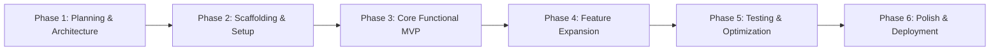
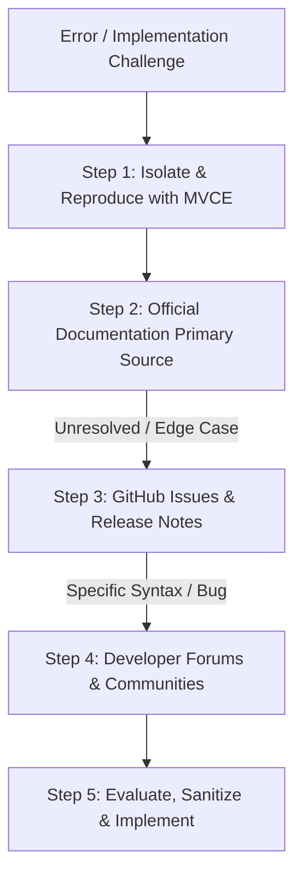
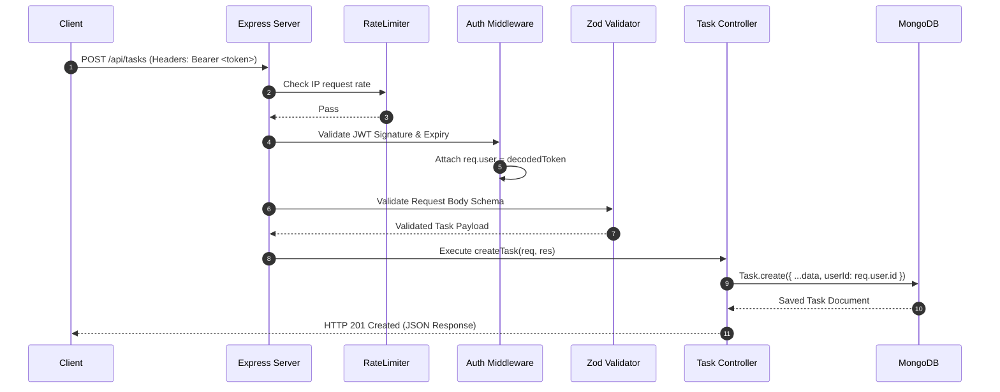

# Week 2: Full Technical Documentation

## Intern Career Path — Web Development
- **Portal ID:** ICP-2AA73905-2026
- **Repository:** ICP-2AA73905-2026-REPO
- **Internship Track:** Web Development Self-Learning Program
- **Module:** Week 2 — Core Engineering, Research Methodologies & Backend Architecture
- **Operating System:** Windows 11 / Windows OS

---

## Table of Contents

1. [Executive Summary & Week 2 Objectives](#1-executive-summary--week-2-objectives)
2. [The 6-Stage Phased Implementation Framework](#2-the-6-stage-phased-implementation-framework)
   - [2.1 The Rationale for Phased Engineering](#21-the-rationale-for-phased-engineering)
   - [2.2 Detailed Breakdown of the 6 Stages](#22-detailed-breakdown-of-the-6-stages)
   - [2.3 Case Study A: Task Management Application](#23-case-study-a-task-management-application)
   - [2.4 Case Study B: Weather Dashboard Application](#24-case-study-b-weather-dashboard-application)
3. [Research Methodology & Technical Troubleshooting Protocol](#3-research-methodology--technical-troubleshooting-protocol)
   - [3.1 The Hierarchical Research Workflow](#31-the-hierarchical-research-workflow)
   - [3.2 Primary Documentation Navigation](#32-primary-documentation-navigation)
   - [3.3 Advanced Community Search Techniques](#33-advanced-community-search-techniques)
   - [3.4 The 4-Step Technical Troubleshooting Protocol](#34-the-4-step-technical-troubleshooting-protocol)
4. [Building Core Functionality & Architectural Separation](#4-building-core-functionality--architectural-separation)
   - [4.1 Defining Core Functionality](#41-defining-core-functionality)
   - [4.2 Three-Tier Architectural Separation](#42-three-tier-architectural-separation)
   - [4.3 Step-by-Step Implementation Blueprint](#43-step-by-step-implementation-blueprint)
   - [4.4 Checkpoints for Core Functionality Validation](#44-checkpoints-for-core-functionality-validation)
5. [Backend Architecture & System Design](#5-backend-architecture--system-design)
   - [5.1 Modular Monolith Architecture Pattern](#51-modular-monolith-architecture-pattern)
   - [5.2 Module Responsibilities Matrix](#52-module-responsibilities-matrix)
   - [5.3 Supporting Infrastructure & Background Services](#53-supporting-infrastructure--background-services)
6. [Database Design & MongoDB Collections](#6-database-design--mongodb-collections)
   - [6.1 Database Overview: `Task_management`](#61-database-overview-task_management)
   - [6.2 Schema & Collections Breakdown](#62-schema--collections-breakdown)
   - [6.3 Entity-Relationship Diagram (ERD)](#63-entity-relationship-diagram-erd)
   - [6.4 High-Performance Indexing Strategy](#64-high-performance-indexing-strategy)
7. [Task Management MERN Backend Implementation](#7-task-management-mern-backend-implementation)
   - [7.1 Backend Codebase Structure](#71-backend-codebase-structure)
   - [7.2 Dependency Stack](#72-dependency-stack)
   - [7.3 RESTful API Endpoints & Specifications](#73-restful-api-endpoints--specifications)
   - [7.4 Security, Authentication & Middleware Pipeline](#74-security-authentication--middleware-pipeline)
   - [7.5 Local Environment Setup & Execution](#75-local-environment-setup--execution)
8. [Deliverables & Verification Summary](#8-deliverables--verification-summary)

---

## 1. Executive Summary & Week 2 Objectives

Week 2 transitions the internship from foundational environment configuration to structural execution, systems architecture, and professional engineering practices. This module establishes core software engineering principles, rigorous research protocols, modular backend system design, and the implementation of a full-fledged REST API for the Task Management Application using the MERN stack (MongoDB, Express, React, Node.js).

### Key Milestones Achieved:
1. **Phased Development Mastery:** Adopted a 6-stage Agile lifecycle framework to systematically deliver decoupled, testable application increments.
2. **Standardized Research & Debugging Protocol:** Established an efficient 4-step troubleshooting methodology utilizing official documentation, GitHub issue tracking, and minimal reproducible examples.
3. **Core Functionality Separation:** Architected client-side logic separating the Presentation Layer, State/Business Logic Layer, and Data Access Layer.
4. **Backend Architecture & Data Modeling:** Designed a production-ready Modular Monolith architecture and defined relational schemas for MongoDB (`Task_management` database).
5. **Constructed MERN Backend API:** Built a complete Express.js API featuring JWT authentication, Zod input validation, private task CRUD operations, and drag-and-drop reordering.

---

## 2. The 6-Stage Phased Implementation Framework

### 2.1 The Rationale for Phased Engineering

Building web applications in a single monolithic pass inevitably produces scope creep, merge conflicts, brittle architecture, and debugging friction. Phased engineering deconstructs complex requirements into sequential, verifiable milestones, ensuring that core business logic and data persistence operate reliably before aesthetic or secondary enhancements are introduced.



---

### 2.2 Detailed Breakdown of the 6 Stages

#### Phase 1: Planning, Requirements & Architectural Design
- **Core Focus:** Establishing technical specifications, data schemas, and API contracts before writing code.
- **Key Tasks:** Define user stories, design database schemas (`Task`, `User`, `Weather`), draw wireframes, specify REST endpoint signatures, and determine external dependency trade-offs.
- **Deliverables:** Architectural diagrams, schema blueprints, and API contract specifications.

#### Phase 2: Environment Setup & Project Scaffolding
- **Core Focus:** Creating an isolated, reproducible development repository.
- **Key Tasks:** Initialize folder hierarchies (`/src`, `/components`, `/services`, `/models`, `/routes`, `/controllers`), configure build tools (Vite, Babel, Webpack), set up ESLint/Prettier, and manage environment variables via `.env`.
- **Deliverables:** Zero-warning compiling boilerplate project.

#### Phase 3: Core Functional MVP (Minimum Viable Product)
- **Core Focus:** Implementing the primary user journey and core business logic without cosmetic distraction.
- **Key Tasks:** Implement pure business logic functions, configure state storage, write core database CRUD endpoints, and verify end-to-end data flow.
- **Deliverables:** Functional MVP executing data creation, modification, and persistence.

#### Phase 4: Feature Expansion & Edge Case Handling
- **Core Focus:** Extending functionality and hardening system resilience.
- **Key Tasks:** Implement search, multi-criteria filtering, sorting, pagination, form validation, error banners, and asynchronous loading states.
- **Deliverables:** Feature-complete application handling standard and edge-case user inputs.

#### Phase 5: Testing, Refactoring & Performance Tuning
- **Core Focus:** Ensuring maintainability, reliability, and low latency.
- **Key Tasks:** Refactor repetitive code into utility modules, write unit/integration tests, audit bundle sizes, optimize database queries with indexing, and eliminate race conditions.
- **Deliverables:** Passing automated test suites and optimized performance metrics.

#### Phase 6: UI Polish, Accessibility & Production Deployment
- **Core Focus:** Elevating user experience, accessibility compliance, and deploying to production.
- **Key Tasks:** Responsive breakpoints (mobile, tablet, desktop), WCAG 2.1 accessibility compliance (ARIA labels, keyboard navigation), micro-interactions, dark/light theme switching, and live cloud deployment (Vercel, Render, Railway, GitHub Pages).
- **Deliverables:** Live production URL and finalized user documentation.

---

### 2.3 Case Study A: Task Management Application

| Phase | Milestone | Specific Deliverables & Focus |
| :--- | :--- | :--- |
| **Phase 1** | Schema & Requirements | Formulate `User`, `Team`, and `Task` schemas (`title`, `status`, `priority`, `dueDate`, `position`). |
| **Phase 2** | MERN Scaffolding | Setup Express backend server, Mongoose connection, folder structures, and CORS middleware. |
| **Phase 3** | Core CRUD API & State | Build `POST /api/tasks`, `GET /api/tasks`, `PATCH /api/tasks/:id`, `DELETE /api/tasks/:id` with JWT auth. |
| **Phase 4** | Drag-and-Drop & Filters | Implement `PATCH /api/tasks/reorder`, status filtering (All, Pending, Completed), and search query filters. |
| **Phase 5** | Validation & Error Handling | Zod schema validation middleware, duplicate title prevention, centralized error handler. |
| **Phase 6** | UI Themes & Deployment | Build responsive dashboard, drag-and-drop Kanban board, and deploy API to Render/Railway. |

---

### 2.4 Case Study B: Weather Dashboard Application

| Phase | Milestone | Specific Deliverables & Focus |
| :--- | :--- | :--- |
| **Phase 1** | API Specs & Wireframes | Evaluate OpenWeatherMap payload structure, design current card and 5-day forecast grid. |
| **Phase 2** | Scaffold & API Client | Initialize client app, store API keys securely in `.env`, create `WeatherService` fetch module. |
| **Phase 3** | Search & Current Weather | City search form, async API call, transform raw JSON into view models (temperature, humidity, wind). |
| **Phase 4** | Geolocation & Forecast | Integrate Browser Geolocation API, calculate 5-day daily forecasts from 3-hour interval payloads. |
| **Phase 5** | Resilience & Cache | Handle 404 city errors, offline states, network retries, and cache recent city searches in `localStorage`. |
| **Phase 6** | Charts & Production Release | Dynamic temperature trend chart using Chart.js, Celsius/Fahrenheit toggle, deploy to Vercel. |

---

## 3. Research Methodology & Technical Troubleshooting Protocol

### 3.1 The Hierarchical Research Workflow

In professional web development, unstructured search and blind copy-pasting lead to architectural fragility and security risks. A disciplined developer follows a hierarchical lookup strategy:



---

### 3.2 Primary Documentation Navigation

Official documentation is the authoritative source for API specifications, runtime behaviors, and browser compatibility.

| Resource | Official URL | Primary Use Case |
| :--- | :--- | :--- |
| **MDN Web Docs** | `developer.mozilla.org` | Standard JavaScript built-ins (`Array`, `Promise`, `Async/Await`), Web APIs (`Fetch`, `LocalStorage`, `Geolocation`), DOM Events, CSS Flexbox & Grid. |
| **Express.js Docs** | `expressjs.com` | Routing, middleware chaining, error-handling middleware, request/response headers. |
| **Mongoose Docs** | `mongoosejs.com` | Schema definitions, validation hooks, virtuals, query populates, indexing. |
| **Can I Use** | `caniuse.com` | Browser feature compatibility checking across Chrome, Firefox, Safari, and Edge. |

---

### 3.3 Advanced Community Search Techniques

#### A. Stack Overflow Precision Search
- Tag and status filtering: `[javascript] [mongoose] is:accepted score:10.. "Cast to ObjectId failed"`
- Scope-specific exact error matching: `"ValidationError" [express] [zod]`

#### B. GitHub Issues & Discussions
- Searching closed issues for library-specific bugs: `repo:expressjs/express is:issue is:closed "ERR_HTTP_HEADERS_SENT"`
- Investigating recent breaking changes in library pull requests and changelogs.

---

### 3.4 The 4-Step Technical Troubleshooting Protocol

```
1. ISOLATE  ──►  2. QUERY  ──►  3. EVALUATE  ──►  4. SYNTHESIZE
```

1. **Isolate (Create an MVCE):** Formulate a **Minimum, Verifiable, Complete Example**. Read stack traces to pinpoint the exact file, line number, and error type. Inspect runtime values using breakpoints or structured logging.
2. **Query (Formulate Precision Searches):** Avoid vague phrases like *"app not working"*. Instead, use exact error names and technical contexts (e.g., `Express "Cannot set headers after they are sent to the client"`).
3. **Evaluate (Sanitize & Audit):** Verify that suggested fixes adhere to modern standards (ES6+), avoid dangerous anti-patterns (`eval()`, direct DOM injection of unsanitized HTML), and fit the application architecture.
4. **Synthesize & Document:** Type the solution manually, understand its mechanics, and document the root cause and resolution in project notes.

---

## 4. Building Core Functionality & Architectural Separation

### 4.1 Defining Core Functionality

**Core Functionality** is the decoupled foundation of business logic, state mutations, and data access pipelines that fulfill the application's primary value proposition. It must operate flawlessly before visual polish or animations are applied.

---

### 4.2 Three-Tier Architectural Separation

```
┌────────────────────────────────────────────────────────┐
│               1. Presentation Layer (UI)               │
│         (HTML Templates, CSS, Event Listeners)         │
└──────────────────────────┬─────────────────────────────┘
                           │ Dispatches User Actions
                           ▼
┌────────────────────────────────────────────────────────┐
│             2. State & Business Logic Layer            │
│         (Pure Reducers, CRUD Helpers, Filter Rules)    │
└──────────────────────────┬─────────────────────────────┘
                           │ Requests / Persists Data
                           ▼
┌────────────────────────────────────────────────────────┐
│             3. Data & Service Access Layer             │
│    (REST API Fetch Clients, LocalStorage, Utilities)   │
└────────────────────────────────────────────────────────┘
```

---

### 4.3 Step-by-Step Implementation Blueprint

#### 1. Data Schema Modeling
```javascript
/**
 * @typedef {Object} Task
 * @property {string} id - Unique task identifier
 * @property {string} title - Task title
 * @property {string} description - Detailed task description
 * @property {'low' | 'medium' | 'high'} priority - Priority category
 * @property {string} dueDate - ISO date string
 * @property {boolean} isCompleted - Status flag
 * @property {number} createdAt - Epoch timestamp
 */
```

#### 2. Pure Business Logic & State Reducers
```javascript
// Application State Container
let appState = {
  tasks: [],
  filter: 'all' // 'all' | 'active' | 'completed'
};

// Pure CRUD Helper Functions (Immutable State Updates)
function createTask(title, description = '', priority = 'medium', dueDate = '') {
  return {
    id: 'task_' + Date.now() + '_' + Math.random().toString(36).substring(2, 9),
    title: title.trim(),
    description: description.trim(),
    priority,
    dueDate,
    isCompleted: false,
    createdAt: Date.now()
  };
}

function addTask(state, newTask) {
  return { ...state, tasks: [newTask, ...state.tasks] };
}

function toggleTaskStatus(state, taskId) {
  return {
    ...state,
    tasks: state.tasks.map(task =>
      task.id === taskId ? { ...task, isCompleted: !task.isCompleted } : task
    )
  };
}

function deleteTask(state, taskId) {
  return {
    ...state,
    tasks: state.tasks.filter(task => task.id !== taskId)
  };
}
```

#### 3. Asynchronous Service & API Handlers
```javascript
const WeatherService = {
  BASE_URL: 'https://api.openweathermap.org/data/2.5',
  API_KEY: process.env.WEATHER_API_KEY || 'YOUR_API_KEY',

  async fetchCurrentWeather(city) {
    if (!city || typeof city !== 'string') {
      throw new Error('Please provide a valid city name.');
    }

    const endpoint = `${this.BASE_URL}/weather?q=${encodeURIComponent(city)}&units=metric&appid=${this.API_KEY}`;
    const response = await fetch(endpoint);
    
    if (!response.ok) {
      if (response.status === 404) throw new Error(`City "${city}" not found.`);
      if (response.status === 401) throw new Error('Invalid API Key.');
      throw new Error(`Weather fetch failed: ${response.statusText}`);
    }

    const data = await response.json();
    return {
      cityName: data.name,
      country: data.sys?.country,
      temperature: Math.round(data.main.temp),
      feelsLike: Math.round(data.main.feels_like),
      humidity: data.main.humidity,
      windSpeed: data.wind.speed,
      condition: data.weather[0]?.main,
      iconUrl: `https://openweathermap.org/img/wn/${data.weather[0]?.icon}@2x.png`
    };
  }
};
```

#### 4. Persistent Storage Layer
```javascript
const StorageManager = {
  STORAGE_KEY: 'icp_task_manager_data',

  save(tasks) {
    try {
      localStorage.setItem(this.STORAGE_KEY, JSON.stringify(tasks));
    } catch (err) {
      console.error('Failed to save to LocalStorage:', err);
    }
  },

  load() {
    try {
      const raw = localStorage.getItem(this.STORAGE_KEY);
      return raw ? JSON.parse(raw) : [];
    } catch (err) {
      console.error('Failed to load from LocalStorage:', err);
      return [];
    }
  }
};
```

---

### 4.4 Checkpoints for Core Functionality Validation

- [x] **End-to-End Execution:** Data flows cleanly from user submission to state container and persistent store.
- [x] **Error Boundary Integrity:** Invalid inputs and network failures produce clear UI feedback rather than uncaught JavaScript runtime crashes.
- [x] **State Persistence:** Refreshing the browser preserves tasks and preferences accurately.
- [x] **Zero DOM Coupling in Business Logic:** State functions can be executed and tested in pure Node.js environments without browser DOM dependencies.

---

## 5. Backend Architecture & System Design

### 5.1 Modular Monolith Architecture Pattern

The Task Management system employs a **Modular Monolith** architecture: a unified, cohesive codebase decomposed into clear, decoupled domain modules. This enables rapid local development and straightforward deployment while establishing strict domain boundaries for future microservices extraction if scale demands it.

```text
┌──────────────────────┐
│ Web / Mobile Clients │
└──────────┬───────────┘
           │ HTTPS / REST (JSON)
┌──────────▼───────────┐
│ API Gateway / Express│
└──────────┬───────────┘
           │
┌──────────▼─────────────────────────────────────────────┐
│ Backend Application — Modular Monolith                  │
│                                                         │
│  Auth       Users       Teams       Projects            │
│  Tasks      Comments    Notifications  Search           │
│  Audit      Files                                      │
└──────────┬───────────────────┬───────────────────┬─────┘
           │                   │                   │
     ┌─────▼──────┐      ┌─────▼─────┐      ┌─────▼──────┐
     │ Persistence│      │   Redis   │      │   Object   │
     │  (MongoDB) │      │ cache/que │      │   Storage  │
     └─────┬──────┘      └───────────┘      └────────────┘
           │
     ┌─────▼──────────┐
     │ Background Jobs│
     │ (Worker Queue) │
     └─────┬──────────┘
           │
   ┌───────┼────────┬───────────┐
   ▼       ▼        ▼           ▼
 Email   Push   Scheduled    File/Image
 (SMTP) (WebPush)(node-cron) (Multer)
```

---

### 5.2 Module Responsibilities Matrix

| Module | Core Responsibility |
| :--- | :--- |
| **Auth** | User registration, credential verification, bcrypt password hashing, JWT token signing and refresh. |
| **Users** | Profile management, avatar management, and user preference settings. |
| **Teams** | Workspace provisioning, organization hierarchy, team invitations, and role-based permissions. |
| **Projects** | Project metadata, ownership boundaries, and project-level status metrics. |
| **Tasks** | Task CRUD, status workflows, priority tags, due dates, assignee relationships, and drag-and-drop ordering. |
| **Comments** | Real-time task discussions, threaded replies, and mention tags. |
| **Notifications** | In-app notification feeds, Web Push notifications, and email alerts for task assignments. |
| **Search** | Indexed query parsing across tasks, projects, and team members. |
| **Audit** | Immutable append-only audit trail recording critical user and system actions. |
| **Files** | File attachment metadata, MIME-type validation, and integration with object storage. |

---

### 5.3 Supporting Infrastructure & Background Services

- **Redis Caching & Rate Limiter:** Caches frequent read operations, stores session blacklists, and powers IP rate limiters (`express-rate-limit`).
- **Background Worker (`node-cron`):** Executes scheduled jobs (e.g., daily due-date reminders, overdue task notifications).
- **Communication Dispatchers (`nodemailer` & `web-push`):** Delivers asynchronous transactional emails and browser push alerts.

---

## 6. Database Design & MongoDB Collections

### 6.1 Database Overview: `Task_management`

The persistence layer is powered by **MongoDB** via the **Mongoose ODM**. Documents use MongoDB `ObjectId` (`_id`) primary keys and leverage foreign key references (`ref: 'User'`, `ref: 'Team'`, `ref: 'Task'`).

---

### 6.2 Schema & Collections Breakdown

| Collection | Description / Purpose | Key Schema Fields |
| :--- | :--- | :--- |
| `users` | Stores user credentials, profiles, and security flags. | `_id`, `name`, `email` (unique), `passwordHash`, `avatarUrl`, `createdAt`, `updatedAt` |
| `teams` | Workspaces grouping projects and users. | `_id`, `name`, `description`, `createdBy`, `createdAt`, `updatedAt` |
| `teamMembers` | Relational join collection mapping users to teams with roles. | `_id`, `teamId`, `userId`, `role` (`admin`/`member`/`viewer`), `joinedAt` |
| `tasks` | Primary work items with workflow states. | `_id`, `teamId`, `userId`, `title`, `description`, `status`, `priority`, `category`, `position`, `dueDate`, `createdAt`, `updatedAt` |
| `comments` | Collaboration comments attached to specific tasks. | `_id`, `taskId`, `userId`, `message`, `createdAt`, `updatedAt` |
| `notifications` | In-app alerts and read statuses. | `_id`, `userId`, `type`, `message`, `taskId`, `isRead`, `createdAt` |
| `activityLogs` | Immutable audit log of all system actions. | `_id`, `userId`, `teamId`, `taskId`, `action`, `details`, `createdAt` |

---

### 6.3 Entity-Relationship Diagram (ERD)

```text
  users ───< teamMembers >─── teams ───< tasks ───< comments
    │                           │          │
    │                           │          └───< activityLogs
    │                           │
    ├───< notifications         └───< projects
    ├───< comments
    └───< activityLogs
```

---

### 6.4 High-Performance Indexing Strategy

To guarantee sub-millisecond query response times at scale:
- `users.email`: Unique index preventing duplicate account registrations.
- `teamMembers`: Compound unique index on `{ teamId: 1, userId: 1 }` preventing duplicate memberships.
- `tasks`: Compound index on `{ userId: 1, status: 1 }` and `{ userId: 1, position: 1 }` for instant dashboard loading and Kanban ordering.
- `comments`: Index on `{ taskId: 1, createdAt: -1 }` for reverse-chronological conversation retrieval.
- `notifications`: Compound index on `{ userId: 1, isRead: 1, createdAt: -1 }`.

---

## 7. Task Management MERN Backend Implementation

### 7.1 Backend Codebase Structure

The backend implementation is located in `Week2/Task Management/backend/` and follows an industry-standard MVC/layered architecture:

```
Week2/Task Management/backend/
├── .env                       # Environment variables (PORT, MONGO_URI, JWT_SECRET)
├── package.json               # Dependencies and execution scripts
├── README.md                  # Backend API documentation
├── src/
│   ├── config/
│   │   └── db.js              # Mongoose database connection setup
│   ├── controllers/
│   │   ├── authController.js  # User signup, signin, profile handlers
│   │   └── taskController.js  # CRUD & reorder task handlers
│   ├── middleware/
│   │   ├── auth.js            # JWT Bearer token verification
│   │   ├── errorHandler.js    # Centralized HTTP error handling
│   │   └── validate.js        # Zod schema validation middleware
│   ├── models/
│   │   ├── Activity.js        # Activity log schema
│   │   ├── Label.js           # Task label/tag schema
│   │   ├── Task.js            # Task entity schema
│   │   ├── User.js            # User authentication schema
│   │   └── UserRole.js        # Role management schema
│   ├── routes/
│   │   ├── auth.js            # Authentication route declarations
│   │   ├── labels.js          # Label management routes
│   │   └── tasks.js           # Task REST endpoint declarations
│   ├── utils/
│   │   └── logger.js          # Structured logging utility
│   └── server.js              # Application entry point & Express bootstrap
└── tests/                     # Integration and unit tests
```

---

### 7.2 Dependency Stack

```json
{
  "dependencies": {
    "bcryptjs": "^3.0.2",
    "cors": "^2.8.5",
    "dotenv": "^16.5.0",
    "express": "^5.1.0",
    "express-rate-limit": "^8.7.0",
    "ioredis": "^6.0.0",
    "jsonwebtoken": "^9.0.2",
    "mongoose": "^8.16.1",
    "multer": "^2.4.0",
    "node-cron": "^4.6.0",
    "nodemailer": "^10.0.10",
    "web-push": "^3.6.7",
    "zod": "^3.24.4"
  }
}
```

---

### 7.3 RESTful API Endpoints & Specifications

All protected routes require an `Authorization: Bearer <jwt_token>` header.

| HTTP Method | Route Endpoint | Access Level | Description |
| :--- | :--- | :--- | :--- |
| `GET` | `/health` | Public | Server health status check. |
| `POST` | `/api/auth/signup` | Public | Registers a new user; returns user object and JWT token. |
| `POST` | `/api/auth/signin` | Public | Authenticates credentials; returns JWT bearer token. |
| `GET` | `/api/auth/me` | Protected | Retrieves authenticated user profile details. |
| `GET` | `/api/tasks` | Protected | Lists tasks for caller; supports `status`, `priority`, `category` filters. |
| `POST` | `/api/tasks` | Protected | Creates a new task assigned to the authenticated user. |
| `GET` | `/api/tasks/:id` | Protected | Retrieves details of a specific task owned by the user. |
| `PATCH` | `/api/tasks/:id` | Protected | Updates fields (title, description, status, priority, dueDate). |
| `DELETE` | `/api/tasks/:id` | Protected | Permanently deletes a private task. |
| `PATCH` | `/api/tasks/reorder` | Protected | Bulk updates task positions for drag-and-drop persistence. |

---

### 7.4 Security, Authentication & Middleware Pipeline



1. **Password Security:** All passwords are salted and hashed using `bcryptjs` with standard work factors before persistence.
2. **Stateless JWT Tokens:** Tokens are cryptographically signed using `jsonwebtoken` and verified on every protected route.
3. **Strict Request Validation:** The `validate` middleware executes Zod schemas to reject invalid payloads with HTTP 400 before hitting controllers.
4. **Centralized Error Handling:** The global `errorHandler` middleware catches uncaught exceptions, preventing server crashes and masking sensitive stack traces in production.

---

### 7.5 Local Environment Setup & Execution

```powershell
# 1. Navigate to the backend directory
cd "Week2/Task Management/backend"

# 2. Configure environment variables (.env)
# PORT=5000
# MONGO_URI=mongodb://localhost:27017/Task_management
# JWT_SECRET=your_super_secret_jwt_key

# 3. Install NPM dependencies
npm install

# 4. Launch development server with automatic file watching
npm run dev

# Server outputs: Server listening on http://localhost:5000
```

---

## 8. Deliverables & Verification Summary

The following documentation modules, architectural designs, and functional code assets have been delivered and verified for Week 2:

| Module / Artifact | Description | Status |
| :--- | :--- | :--- |
| [`Week2/README.md`](./README.md) | Week 2 syllabus, focus areas, and milestone summary. | ✅ Complete |
| [`Week2/implementation-phases.md`](./implementation-phases.md) | 6-stage phased implementation guide and project case studies. | ✅ Complete |
| [`Week2/research-methodology.md`](./research-methodology.md) | Hierarchical developer research and 4-step troubleshooting protocol. | ✅ Complete |
| [`Week2/core-functionality.md`](./core-functionality.md) | Core logic blueprint, state architecture, and service layer separation. | ✅ Complete |
| [`Week2/backend-architecture.md`](./backend-architecture.md) | Modular Monolith system architecture and module specifications. | ✅ Complete |
| [`Week2/mongodb-collections.md`](./mongodb-collections.md) | `Task_management` database schema, ERD, and indexing strategy. | ✅ Complete |
| [`Week2/Task Management/backend/`](./Task%20Management/backend/) | Functional Express & Mongoose REST API with JWT auth and task CRUD. | ✅ Complete |
| [`Week2/documentation.md`](./documentation.md) | Master comprehensive documentation for the entire Week 2 curriculum. | ✅ Complete |
