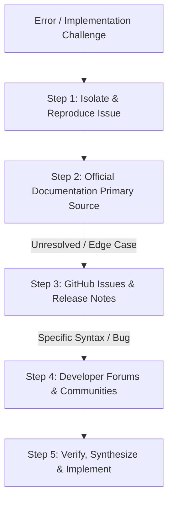

# Research Methodology Using Documentation and Forums

## 1. Overview & Research Philosophy

In modern software development, efficient problem-solving relies heavily on knowing **where** to look, **how** to evaluate information, and **how** to apply solutions effectively. Unstructured Googling and blind copy-pasting ("cargo culting") lead to fragile code, security vulnerabilities, and knowledge debt.

A disciplined research methodology follows a hierarchical lookup approach:



---

## 2. Primary Documentation Sources (The First Line of Defense)

Official documentation is the single source of truth for syntax, behavior, parameters, and browser support.

### Key Documentation Hubs

| Documentation Resource | Scope & Focus | When to Use |
| :--- | :--- | :--- |
| **MDN Web Docs** (*developer.mozilla.org*) | HTML, CSS, JavaScript core specs, Web APIs (DOM, Fetch, Storage). | Validating JS built-ins (`Array.reduce`, `Promise.all`), DOM events, CSS Flexbox/Grid syntax. |
| **Official Framework Docs** (*react.dev*, *vitejs.dev*) | Component lifecycles, hooks, build pipelines, reactivity rules. | Understanding state management rules, hook dependencies, and config schemas. |
| **Third-Party API Docs** (*OpenWeatherMap*, *REST APIs*) | Endpoint definitions, query parameters, rate limits, status codes. | Constructing API URLs, headers, payload bodies, and error response models. |
| **Can I Use** (*caniuse.com*) | Browser compatibility across standard web platform features. | Checking modern CSS features (subgrid, container queries) or JS APIs across browsers. |

### Documentation Reading Best Practices
1. **Always Check the API Signature:** Review argument types, optional vs required parameters, and return types before writing code.
2. **Review Official Interactive Examples:** Examine official CodeSandbox/live examples provided in docs for intended patterns.
3. **Verify Version Numbers:** Ensure documentation corresponds to your installed library/runtime version.

---

## 3. Developer Forums & Community Channels

When documentation explains *what* an API does but doesn't solve a specific real-world edge case, community forums and issue trackers provide crucial context.

### A. Stack Overflow & Q&A Platforms
- **Advanced Search Syntax:**
  - `[javascript] [fetch] is:accepted score:5..` — Filters by tags, accepted answers, and high community validation.
  - `"TypeError: Failed to fetch" [cors]` — Exact error matching within a specific topic area.
- **Answer Evaluation Checklist:**
  - *Date of Answer:* Was this answer written 10 years ago for ES5, or is it updated for ES6+ / modern standards?
  - *Accepted vs Top Voted:* Sometimes newer, better answers have more upvotes than an old accepted answer.
  - *Comments Section:* Always read comments below an answer; they often highlight deprecated syntax, browser-specific bugs, or security risks.

### B. GitHub Issues & Discussions
- **When to Search:**
  - Build errors, bundler failures, package incompatibilities, or suspected library bugs.
- **Search Techniques:**
  - Search repository `Issues` with filters: `is:issue is:closed "exact error string"`.
  - Look for PRs linking to bug fixes or comments with reproducible workarounds.

### C. Developer Communities & Subreddits
- **Platforms:** Reddit (`r/webdev`, `r/learnjavascript`), Dev.to, Discord community servers.
- **Use Case:** Architectural debates, tool comparisons, design feedback, and best-practice discussions.

---

## 4. The 4-Step Technical Troubleshooting Protocol

```
1. ISOLATE  ──►  2. SEARCH  ──►  3. EVALUATE  ──►  4. SYNTHESIZE
```

### Step 1: Isolate the Problem (Create an MVCE)
- **MVCE = Minimum, Verifiable, Complete Example.**
- Read stack traces carefully: identify file name, line number, and error type.
- Strip away unrelated components or styles to isolate the offending function.
- Check inputs with `console.log()` or browser DevTools breakpoints.

### Step 2: Formulate Precision Search Queries
- ❌ **Poor Query:** `javascript weather app not working`
- ❌ **Poor Query:** `my task form fails on submit button`
- ✅ **Optimized Query:** `Fetch API "Failed to load resource: net::ERR_NAME_NOT_RESOLVED"`
- ✅ **Optimized Query:** `form submit event e.preventDefault() not stopping reload JS`

### Step 3: Evaluate Proposed Solutions
- **Security Check:** Does the snippet use dangerous patterns like `eval()` or unescaped `innerHTML` with user inputs?
- **Modern Standards:** Does it use modern ES6+ (`const`/`let`, `async`/`await`, arrow functions) or outdated patterns (`var`, `XMLHttpRequest`, jQuery)?
- **Fit for Architecture:** Does it solve your root cause without introducing unneeded third-party libraries?

### Step 4: Synthesize & Document
- Type out the solution manually rather than copying and pasting blindly.
- Add concise comments explaining why a specific fix or workaround was applied.
- Keep personal notes of recurring issues in project documentation.
