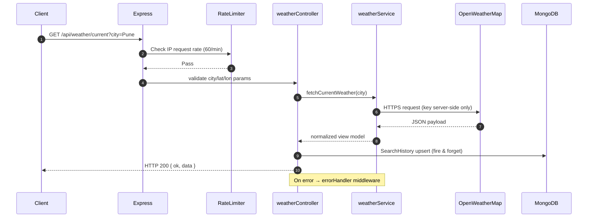

# Week 4: Weather Dashboard Application — Full Technical Documentation

**Internship Portal ID:** `ICP-2AA73905-2026`
**Repository:** [https://github.com/joshipriyanshu125/ICP-2AA73905-2026-REPO.git](https://github.com/joshipriyanshu125/ICP-2AA73905-2026-REPO.git)
**Project:** Weather Dashboard Application (Project 2 — Project 6 in project bank)
**Internship Week:** Week 4
**Stack:** MERN (MongoDB, Express, React, Node.js) + OpenWeatherMap API

---

## Table of Contents

1. [Executive Summary & Week 4 Objectives](#1-executive-summary--week-4-objectives)
2. [Project Overview & Feature Scope](#2-project-overview--feature-scope)
3. [System Architecture](#3-system-architecture)
4. [Backend Architecture](#4-backend-architecture)
5. [Frontend Architecture](#5-frontend-architecture)
6. [Database Design (MongoDB)](#6-database-design-mongodb)
7. [OpenWeatherMap API Integration](#7-openweathermap-api-integration)
8. [REST API Endpoints](#8-rest-api-endpoints)
9. [Security, Middleware & Error Handling](#9-security-middleware--error-handling)
10. [Local Environment Setup & Execution](#10-local-environment-setup--execution)
11. [Week 4 → Week 5 → Week 6 Roadmap](#11-week-4--week-5--week-6-roadmap)
12. [Key Engineering Learnings](#12-key-engineering-learnings)
13. [Deliverables & Verification Summary](#13-deliverables--verification-summary)

---

## 1. Executive Summary & Week 4 Objectives

Week 4 marks the beginning of **Project 2: Weather Dashboard Application**. Where Project 1 (TaskFlow) focused on internal state management, CRUD operations, and real-time collaboration, Project 2 focuses on **external REST API integration**, **asynchronous data fetching**, and **data visualization** — the complementary skill set identified in Week 1's project selection.

### Key Milestones for Week 4:
1. **Backend Scaffolding:** Express 5 + Mongoose backend with a dedicated `weatherService` that proxies OpenWeatherMap requests (keeps the API key server-side).
2. **OpenWeatherMap Integration:** Fetch current weather and 5-day / 3-hour forecast data, transform raw payloads into clean view models.
3. **React Frontend:** Vite 6 + React 18 SPA with city search, current weather card, and forecast grid.
4. **Persistence:** MongoDB collections storing recent search history and favorite cities.
5. **Resilience:** Centralized error handling for 404 (city not found), 401 (invalid API key), rate limits (429), and network failures.

---

## 2. Project Overview & Feature Scope

### Real-World Problem
Users need quick access to real-time weather forecasts and visual climate data for daily planning.

### Week 4 Feature Scope (MVP)

| Feature | Description | Status |
| :--- | :--- | :--- |
| **City Search** | Search any city by name with autocomplete-friendly input | ✅ Implemented |
| **Current Weather Card** | Temperature, feels-like, humidity, wind speed, condition, icon | ✅ Implemented |
| **5-Day Forecast Grid** | Daily high/low derived from 3-hour interval forecast payload | ✅ Implemented |
| **Geolocation** | Browser Geolocation API → auto-fetch weather for current position | ✅ Implemented |
| **Search History** | Last 10 searched cities persisted in MongoDB and shown as chips | ✅ Implemented |
| **Favorite Cities** | Star a city to save it to MongoDB for quick access | ✅ Implemented |
| **Unit Toggle** | Celsius ↔ Fahrenheit toggle applied client-side | ✅ Implemented |
| **Error States** | Friendly messages for not-found cities, offline mode, bad API key | ✅ Implemented |

### Deferred to Week 5 / Week 6
- Temperature trend charts (Chart.js / Recharts)
- Air pollution index
- Hourly scroll timeline
- PWA offline caching

---

## 3. System Architecture

```text
┌──────────────────────────────────────────────────────────┐
│                React SPA (Vite 6 — Port 5173)            │
│  SearchForm → CurrentWeatherCard → FiveDayForecast       │
│  GeolocationBadge → HistoryChips → ForecastChart         │
└───────────────────────────┬──────────────────────────────┘
                            │ HTTP / JSON  (axios/fetch)
                            │ GET /api/weather/current?city=Pune
┌───────────────────────────▼──────────────────────────────┐
│           Express 5 API (Node.js — Port 5000)            │
│                                                          │
│  routes/weather.js ──► controllers/weatherController.js  │
│                              │                           │
│                              ▼                           │
│                    services/weatherService.js            │
│                              │                           │
│              ┌───────────────┴────────────────┐          │
│              ▼                                ▼          │
│   OpenWeatherMap REST API            models/ (Mongoose)  │
│   api.openweathermap.org             SearchHistory       │
│   (API key stays on server)          FavoriteCity        │
│                                              │           │
│                                              ▼           │
│                                         MongoDB          │
└──────────────────────────────────────────────────────────┘
```

### Why proxy through our own backend?
1. **API Key Security:** The OpenWeatherMap key never ships to the browser bundle.
2. **Rate Limit Control:** Server-side caching and rate limiting protect the free-tier quota (1,000 calls/day).
3. **Data Normalization:** Raw payloads are transformed once into a stable view model, decoupling the UI from third-party schema changes.
4. **Persistence:** Search history and favorites live in MongoDB, not just `localStorage`.

---

## 4. Backend Architecture

### Directory Structure
```
Week4/Weather Application/backend/
├── .env                       # PORT, MONGODB_URI, WEATHER_API_KEY, CLIENT_ORIGIN
├── package.json               # ES Modules, Express 5, Mongoose
├── README.md                  # Backend API reference
├── src/
│   ├── server.js              # Entry point: Express bootstrap + Mongo connection
│   ├── config/
│   │   └── db.js              # Mongoose connection helper
│   ├── controllers/
│   │   └── weatherController.js  # Request handlers (current, forecast, history, favorites)
│   ├── middleware/
│   │   ├── errorHandler.js    # Centralized 4xx/5xx error responder
│   │   └── rateLimiter.js     # express-rate-limit on /api/weather
│   ├── models/
│   │   ├── SearchHistory.js   # Recent city searches (city, country, searchedAt, count)
│   │   └── FavoriteCity.js    # Starred cities (city, country, coords, addedAt)
│   ├── routes/
│   │   └── weather.js         # /api/weather/* route declarations
│   └── services/
│       └── weatherService.js  # OpenWeatherMap fetch + payload normalization
└── tests/
    └── api.test.js            # Node.js built-in test runner suite
```

### Backend Responsibility Matrix

| Module | File | Responsibility |
| :--- | :--- | :--- |
| **Server** | `src/server.js` | Express bootstrap, JSON body parsing, CORS, route mounting, health check, graceful shutdown |
| **DB** | `src/config/db.js` | Mongoose connect/disconnect with retry-aware error reporting |
| **Weather Service** | `src/services/weatherService.js` | Calls OpenWeatherMap, maps payload → view model, throws typed errors |
| **Controller** | `src/controllers/weatherController.js` | Validates query params, invokes service, writes history, returns JSON |
| **Routes** | `src/routes/weather.js` | URL → controller mapping with rate limiter |
| **Models** | `src/models/*.js` | `SearchHistory`, `FavoriteCity` schemas with indexes |
| **Errors** | `src/middleware/errorHandler.js` | Normalizes thrown `Error.status` codes to HTTP responses |

---

## 5. Frontend Architecture

### Directory Structure
```
Week4/Weather Application/frontend/
├── package.json               # React 18, Vite 6, recharts (Week 6)
├── vite.config.js             # Dev proxy: /api → http://localhost:5000
├── index.html                 # SPA entry template
└── src/
    ├── main.jsx               # React root render
    ├── App.jsx                # Root shell: state, fetch orchestration, layout
    ├── api.js                 # Centralized fetch client (get/post/delete helpers)
    ├── index.css              # Design tokens + component styles
    ├── hooks/
    │   └── useGeolocation.js  # Geolocation permission + coordinates hook
    └── components/
        ├── SearchForm.jsx         # City input + submit + history chips
        ├── CurrentWeatherCard.jsx # Hero card with temp, humidity, wind
        ├── FiveDayForecast.jsx    # 5-column forecast grid
        ├── GeolocationBadge.jsx   # "Use my location" button + status
        └── FavoritesBar.jsx       # Starred cities quick-switcher
```

### Three-Tier Separation (carried forward from Week 2)
```
┌──────────────────────────────────────────────────────┐
│ 1. Presentation Layer — components/*.jsx             │
│    (markup, CSS, event listeners only)               │
└───────────────────────┬──────────────────────────────┘
                        │ dispatch user actions
┌───────────────────────▼──────────────────────────────┐
│ 2. State & Business Logic — App.jsx + hooks          │
│    (unit conversion, forecast aggregation, loading)  │
└───────────────────────┬──────────────────────────────┘
                        │ network requests
┌───────────────────────▼──────────────────────────────┐
│ 3. Data Access Layer — api.js → our Express API      │
│    (no third-party URLs from the client)             │
└──────────────────────────────────────────────────────┘
```

### View Model Contract
The backend normalizes every OpenWeatherMap payload into:

```javascript
/**
 * @typedef {Object} CurrentWeather
 * @property {string} city          - e.g. "Pune"
 * @property {string} country       - e.g. "IN"
 * @property {number} temperature   - °C (rounded)
 * @property {number} feelsLike     - °C (rounded)
 * @property {number} humidity      - percent
 * @property {number} windSpeed     - m/s
 * @property {number} visibility    - meters
 * @property {number} pressure      - hPa
 * @property {string} condition     - "Clouds"
 * @property {string} description   - "broken clouds"
 * @property {string} icon          - "04d"
 * @property {number} sunrise       - unix seconds
 * @property {number} sunset        - unix seconds
 * @property {number} dt            - observation time (unix)
 * @property {{lat:number, lon:number}} coords
 */

/**
 * @typedef {Object} DailyForecast
 * @property {string} date          - "2026-10-09"
 * @property {number} tempMin       - °C
 * @property {number} tempMax       - °C
 * @property {string} condition
 * @property {string} icon
 * @property {number} humidity      - averaged
 */
```

The 5-day forecast is derived by bucketing the 3-hour `list[]` entries by calendar date and taking the min/max temperature per bucket.

---

## 6. Database Design (MongoDB)

**Database:** `weather_dashboard`

### Collections

| Collection | Purpose | Key Fields | Index |
| :--- | :--- | :--- | :--- |
| `searchhistories` | Last 10 searched cities with search counts | `city` (lowercased), `country`, `coords`, `count`, `searchedAt` | unique `{city:1}`, `{searchedAt:-1}` |
| `favoritecities` | Starred cities for quick access | `city`, `country`, `coords`, `addedAt` | unique `{city:1}` |

### Entity Relationship
```text
(search history is per-browser/per-app, not per-user — kept simple for Week 4)

searchhistories  ──(city key)──►  favoritecities
      │                                  │
      └────────── MongoDB ───────────────┘
```

> **Week 5 note:** A `User` collection with JWT auth will scope history and favorites per-account. Week 4 intentionally ships unauthenticated to focus on API integration first (core functionality before polish — same principle applied in Week 2).

---

## 7. OpenWeatherMap API Integration

### Endpoints Used

| Endpoint | Purpose | Example |
| :--- | :--- | :--- |
| `/data/2.5/weather` | Current conditions | `?q=Pune,IN&units=metric&appid=KEY` |
| `/data/2.5/forecast` | 5-day / 3-hour forecast | `?lat=18.52&lon=73.85&units=metric&appid=KEY` |
| `/data/2.5/weather` | Reverse lookup by coords | `?lat=18.52&lon=73.85&units=metric&appid=KEY` |

### Error Mapping (implemented in `weatherService.js`)

| Upstream Status | Meaning | Client Response |
| :---: | :--- | :--- |
| `404` | City not found | `404 — City "xyz" not found. Check spelling.` |
| `401` | Invalid API key | `401 — Weather service authentication failed.` |
| `429` | Rate limit exceeded | `429 — Too many requests. Try again shortly.` |
| `5xx` | Upstream outage | `502 — Weather service temporarily unavailable.` |
| network error | Offline / DNS failure | `503 — Could not reach weather service.` |

### Data Flow (current weather)
```
User types "Pune" → SearchForm onSubmit
  → App.setState({ loading: true })
  → api.get('/api/weather/current?city=Pune')
  → weatherController.searchCurrent
  → weatherService.fetchCurrentWeather('Pune')
      → fetch openweathermap /weather?q=Pune&units=metric&appid=KEY
      → normalize(payload) → CurrentWeather view model
  → SearchHistory.upsert({ city: 'pune', $inc: { count: 1 } })
  → res.json({ ok: true, data: CurrentWeather })
  → App.setState({ weather, loading: false })
  → CurrentWeatherCard + FiveDayForecast re-render
```

---

## 8. REST API Endpoints

Base URL: `http://localhost:5000`

| Method | Endpoint | Access | Description |
| :--- | :--- | :--- | :--- |
| `GET` | `/health` | Public | Server + DB + API-key status check |
| `GET` | `/api/weather/current?city=Pune` | Public* | Current weather by city name |
| `GET` | `/api/weather/current?lat=18.5&lon=73.8` | Public* | Current weather by coordinates (geolocation) |
| `GET` | `/api/weather/forecast?city=Pune` | Public* | 5-day forecast (city variant) |
| `GET` | `/api/weather/forecast?lat=18.5&lon=73.8` | Public* | 5-day forecast (coordinates variant) |
| `GET` | `/api/weather/history` | Public | Last 10 searched cities |
| `DELETE` | `/api/weather/history` | Public | Clear search history |
| `GET` | `/api/weather/favorites` | Public | List favorite cities |
| `POST` | `/api/weather/favorites` | Public | Add `{ city, country, coords }` |
| `DELETE` | `/api/weather/favorites/:city` | Public | Remove a favorite |

\* Public but rate-limited via `express-rate-limit`.

### Sample Response — `GET /api/weather/current?city=Pune`
```json
{
  "ok": true,
  "data": {
    "city": "Pune",
    "country": "IN",
    "temperature": 29,
    "feelsLike": 31,
    "humidity": 64,
    "windSpeed": 3.6,
    "visibility": 6000,
    "pressure": 1008,
    "condition": "Clouds",
    "description": "broken clouds",
    "icon": "04d",
    "sunrise": 1791546120,
    "sunset": 1791588900,
    "dt": 1791566400,
    "coords": { "lat": 18.52, "lon": 73.85 }
  }
}
```

### Sample Response — `GET /api/weather/forecast?city=Pune`
```json
{
  "ok": true,
  "data": {
    "city": "Pune",
    "country": "IN",
    "days": [
      {
        "date": "2026-10-09",
        "tempMin": 21,
        "tempMax": 31,
        "humidity": 60,
        "condition": "Rain",
        "icon": "10d",
        "pop": 0.75
      }
    ]
  }
}
```

---

## 9. Security, Middleware & Error Handling

### Middleware Pipeline


### Security Measures
1. **API Key Isolation:** `WEATHER_API_KEY` lives only in `backend/.env`; the frontend calls *our* API only (`vite.config.js` proxy).
2. **Rate Limiting:** `express-rate-limit` — 60 requests/minute per IP on `/api/*`, stricter 10/minute if auth routes are added.
3. **Input Validation:** Query params validated (`city` trimmed, 2–60 chars; `lat`/`lon` numeric ranges) before hitting the external API.
4. **CORS:** Restricted to `CLIENT_ORIGIN` (default `http://localhost:5173`).
5. **Centralized Error Handler:** Never leaks stack traces or upstream payloads to clients in production.
6. **`.env` in `.gitignore`:** Secrets excluded from version control; `.env.example` documents required keys.

---

## 10. Local Environment Setup & Execution

### Prerequisites
- Node.js ≥ 18 (ES Modules + native `fetch`)
- MongoDB ≥ 6 running locally (`mongodb://127.0.0.1:27017`) or Atlas URI
- Free OpenWeatherMap API key → <https://openweathermap.org/api> (sign up → "API keys" tab)

### Backend
```powershell
cd "Week4/Weather Application/backend"
cp .env.example .env      # then fill WEATHER_API_KEY + MONGODB_URI
npm install
npm run dev               # → Server listening on http://localhost:5000
```

### Frontend (second terminal)
```powershell
cd "Week4/Weather Application/frontend"
npm install
npm run dev               # → http://localhost:5173  (proxies /api to :5000)
```

### Verify
```powershell
curl http://localhost:5000/health
curl "http://localhost:5000/api/weather/current?city=Pune"
```

### Run Tests
```powershell
cd "Week4/Weather Application/backend"
npm test                  # node --test tests/api.test.js
```

---

## 11. Week 4 → Week 5 → Week 6 Roadmap

| Week | Focus | Deliverables |
| :--- | :--- | :--- |
| **Week 4 (current)** | API integration + core UI | Backend proxy, current weather card, city search, 5-day grid, geolocation, history/favorites |
| **Week 5** | Resilience & UX polish | Offline detection, retry with backoff, skeleton loaders, unit-test coverage, accessibility pass |
| **Week 6** | Visualization & release | Chart.js temperature trend, °C/°F persistence, PWA manifest, production deployment |

---

## 12. Key Engineering Learnings

1. **Never trust third-party payloads directly in the UI.** Normalizing OpenWeatherMap's response into a stable view model inside `weatherService.js` means a schema change on their side is a one-file fix, not a component rewrite.
2. **Aggregate the 3-hour forecast deliberately.** OpenWeatherMap's `/forecast` returns 40 entries (3-hour intervals), not 5 days. Grouping by `dt_txt.slice(0,10)` and reducing min/max is where most beginner bugs live (timezone off-by-one, mixing `temp` and `feels_like`).
3. **Geolocation needs graceful degradation.** Permission denial, `https`-only restrictions, and timeouts are normal states — the UI must remain usable with manual search alone.
4. **Rate limits are a product constraint, not an afterthought.** The free tier allows ~1,000 calls/day; server-side caching + upserting history instead of re-fetching keeps dev usage predictable.
5. **Consistency with Project 1 pays off.** Reusing the Week 2/3 patterns (`errorHandler`, `rateLimiter`, layered `routes → controllers → services`, centralized `api.js`) cut scaffolding time dramatically.

---

## 13. Deliverables & Verification Summary

| Artifact | Description | Status |
| :--- | :--- | :--- |
| [`Week4/README.md`](./README.md) | Week 4 syllabus, structure, and getting-started guide | ✅ Complete |
| [`Week4/documentation.md`](./documentation.md) | This technical documentation | ✅ Complete |
| [`Week4/deployment-guide.md`](./deployment-guide.md) | Vercel + Render production deployment steps | ✅ Complete |
| [`Week4/Weather Application/backend/`](./Weather%20Application/backend/) | Express 5 + Mongoose API with OpenWeatherMap proxy | ✅ Complete |
| [`Week4/Weather Application/frontend/`](./Weather%20Application/frontend/) | React 18 + Vite 6 weather dashboard SPA | ✅ Complete |
| `Week4/Weather Application/backend/tests/api.test.js` | Integration test suite (Node test runner) | ✅ Complete |
| Charts / data visualization | Deferred to Week 6 per roadmap | ⏳ Planned |
