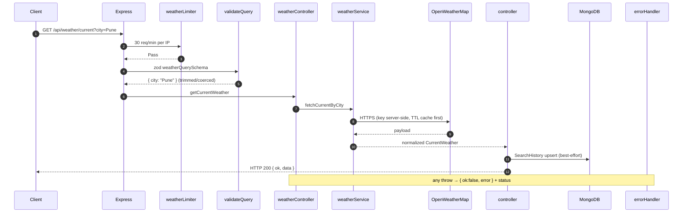

# Week 4: Weather Dashboard Application — Full Technical Documentation

**Internship Portal ID:** `ICP-2AA73905-2026`
**Repository:** [https://github.com/joshipriyanshu125/ICP-2AA73905-2026-REPO.git](https://github.com/joshipriyanshu125/ICP-2AA73905-2026-REPO.git)
**Project:** Weather Dashboard Application (Project 2 — "Project 6" in the project bank)
**Internship Week:** Week 4
**Stack:** MERN (MongoDB, Express, React, Node.js) + OpenWeatherMap API

---

## Table of Contents

1. [Executive Summary & Week 4 Objectives](#1-executive-summary--week-4-objectives)
2. [Project Overview & Feature Scope](#2-project-overview--feature-scope)
3. [System Architecture](#3-system-architecture)
4. [Backend Architecture](#4-backend-architecture)
5. [Frontend Architecture](#5-frontend-architecture)
6. [Database Design (MongoDB)](#6-database-design-mongodb)
7. [OpenWeatherMap API Integration](#7-openweathermap-api-integration)
8. [REST API Endpoints](#8-rest-api-endpoints)
9. [Security, Auth, Middleware & Error Handling](#9-security-auth-middleware--error-handling)
10. [Theme System (Dark / Light)](#10-theme-system-dark--light)
11. [Local Environment Setup & Execution](#11-local-environment-setup--execution)
12. [Week 4 → Week 5 → Week 6 Roadmap](#12-week-4--week-5--week-6-roadmap)
13. [Key Engineering Learnings](#13-key-engineering-learnings)
14. [Deliverables & Verification Summary](#14-deliverables--verification-summary)

---

## 1. Executive Summary & Week 4 Objectives

Week 4 begins **Project 2: Weather Dashboard Application**. Where Project 1 (TaskFlow) focused on internal state management, CRUD operations, and real-time collaboration, Project 2 focuses on **external REST API integration**, **asynchronous data visualization**, and **account-scoped persistence** — the complementary skill set identified in Week 1's project selection.

### Key Milestones Delivered:
1. **Backend Scaffolding:** Express + Mongoose backend with a dedicated `weatherService` that proxies all OpenWeatherMap calls (API key stays server-side).
2. **OpenWeatherMap Integration:** Current weather, 5-day/3-hour forecast, geocoding search — all normalized into stable view models.
3. **Data Visualization:** recharts temperature curve + precipitation probability charts, plus a next-24-hour forecast strip.
4. **Authentication:** Email/password accounts (bcrypt + JWT) with per-user saved locations (row-level scoping in MongoDB).
5. **Design System:** Deep-sky dark theme with **condition-aware accent colors**, a minimalistic light theme, and per-route head metadata.
6. **Resilience:** Centralized error handling for 404 (city not found), 401 (key/auth), 429 (rate limits), timeouts, and offline states — all verified by a 14-test automated suite.

---

## 2. Project Overview & Feature Scope

### Real-World Problem
Users need quick access to real-time weather forecasts and visual climate data for daily planning.

### Implemented Feature Scope

| Feature | Description | Status |
| :--- | :--- | :--- |
| **City Search + Geocoding** | Search-as-you-type suggestions (debounced 300 ms, keyboard-navigable) via OWM Geocoding API | ✅ |
| **Current Conditions Card** | Large display temperature, feels-like, humidity, wind, pressure, visibility, sunrise/sunset | ✅ |
| **Hourly Forecast Strip** | Next 24 hours in 3-hour intervals with icons + rain probability | ✅ |
| **Forecast Charts** | recharts temperature area curve and daily precipitation bar chart (code-split chunk) | ✅ |
| **Multi-Day Forecast** | Daily rows — 5 days on the free plan; auto-upgrades to 7 days if One Call 3.0 is subscribed | ✅ |
| **AI Weather Insights** | 3 brief, actionable recommendations rendered above the hourly strip — LLM-generated when `OPENAI_API_KEY` is set, deterministic rule engine otherwise (the endpoint never fails on the AI layer) | ✅ |
| **Severe-Weather Alerts** | Top-of-dashboard banner: official One Call 3.0 warnings (when subscribed) + custom per-user temperature/wind thresholds configurable in an Alert Settings modal | ✅ |
| **Browser Geolocation** | Real-time auto-locate on load (fresh high-accuracy fix, no cached position, no hardcoded default city), permission states (`idle/locating/granted/denied/unavailable`), and an accuracy badge that warns when the browser only has a coarse (>10 km) network-based position | ✅ |
| **Search History** | Last 10 searched cities persisted in MongoDB, shown as chips with last temperature | ✅ |
| **Saved Locations (Favorites)** | Star cities — requires sign-in; rows scoped per user (`user` + compound unique index) | ✅ |
| **Authentication** | Sign-up / sign-in (`/auth` route), JWT Bearer tokens, bcrypt hashing, session restore | ✅ |
| **Unit Toggle** | °C ↔ °F applied client-side, persisted in `localStorage` | ✅ |
| **Dark / Light Mode** | Deep-sky dark (condition-aware accents) + minimalistic light theme, system-preference default | ✅ |
| **Head Metadata** | Per-route `title`, `description`, `og:title` updated dynamically (dashboard + auth) | ✅ |
| **Error States** | Friendly messages for not-found cities, invalid key, rate limits, offline, auth errors | ✅ |

### Deferred to Week 5 / Week 6
- Air pollution index, PWA offline caching, animated weather backgrounds
- Production deployment (Vercel + Render) — guide already written in `deployment-guide.md`

---

## 3. System Architecture

```text
┌────────────────────────────────────────────────────────────────┐
│          React 18 SPA (Vite 6 — Port 5173)                     │
│  Routes:  /  (Dashboard)              /auth  (Sign in / up)    │
│                                                                │
│  SearchForm → CurrentWeatherCard → HourlyStrip                 │
│  ForecastCharts (lazy) → ForecastList → FavoritesBar           │
│  ThemeContext (dark/light)   AuthContext (JWT session)         │
└──────────────────────────┬─────────────────────────────────────┘
                           │ HTTP / JSON  (fetch + Bearer token)
                           │ GET /api/weather/current?city=Pune
┌──────────────────────────▼─────────────────────────────────────┐
│              Express API (Node.js — Port 5000)                 │
│                                                                │
│  routes/auth.js ──► authController ──► User model (bcrypt)     │
│  routes/weather.js ─► weatherController                        │
│        │  middleware: rateLimiter → zod validate → requireAuth │
│        ▼                                                       │
│  services/weatherService.js  (single OWM gateway)              │
│        │                    │                     │            │
│        ▼                    ▼                     ▼            │
│  /data/2.5/weather   /data/2.5/forecast   /geo/1.0/direct      │
│  (+ optional /data/3.0/onecall for 7-day)                      │
│                                                                │
│  models: User · SearchHistory · FavoriteCity ──► MongoDB       │
└────────────────────────────────────────────────────────────────┘
```

### Design decisions
1. **API Key Security:** `WEATHER_API_KEY` lives only in `backend/.env`; the frontend calls *our* API exclusively (`vite.config.js` proxies `/api` in dev).
2. **Single External Gateway:** every OpenWeatherMap call funnels through `weatherService.js` — one place for caching (TTL map), error mapping, and payload normalization.
3. **Rate Limit Control:** three limiter tiers (auth 20/15min, weather 30/min, general 60/min) protect the free-tier quota (1,000 calls/day).
4. **Persistence:** history is public (per-browser); favorites are authenticated and **row-scoped by user id** — the MERN equivalent of the plan's Supabase row-level security.
5. **Resilient 7-day:** the service silently upgrades to One Call 3.0 when the key has access, otherwise serves the free 5-day data (`source: 'onecall7' | 'forecast5'`).

---

## 4. Backend Architecture

### Directory Structure
```
Week4/Weather Application/backend/
├── .env / .env.example      # PORT, MONGODB_URI, WEATHER_API_KEY, JWT_SECRET, CLIENT_ORIGIN
├── package.json             # ES Modules; express, mongoose, zod, bcryptjs, jsonwebtoken
├── README.md                # Backend API reference
├── src/
│   ├── server.js            # Entry: CORS, JSON, /health, mounts /api/auth, /api/weather, /api/settings
│   ├── config/db.js         # Mongoose connection (non-fatal in dev, fatal in production)
│   ├── controllers/
│   │   ├── authController.js        # signup / signin / me
│   │   ├── settingsController.js    # per-user alert preferences (GET / PUT, user-scoped)
│   │   └── weatherController.js     # current, forecast, search, insights, history, favorites
│   ├── middleware/
│   │   ├── auth.js          # signToken / verifyToken / requireAuth (JWT Bearer)
│   │   ├── validate.js      # validateBody / validateQuery (zod safeParse → friendly 400)
│   │   ├── schemas.js       # zod schemas: weather, insights, search, signup, signin, favorite, settings
│   │   ├── errorHandler.js  # centralized HTTP errors + 404 + httpError() helper
│   │   └── rateLimiter.js   # apiLimiter / weatherLimiter / insightsLimiter / authLimiter
│   ├── models/
│   │   ├── User.js          # name, email (unique), passwordHash, timestamps
│   │   ├── SearchHistory.js # city, country, coords, count, lastIcon/lastTemp
│   │   ├── FavoriteCity.js  # user ref + city + coords; unique {user, city}
│   │   └── UserSettings.js  # user ref + alertEnabled, minTempAlert, maxWindAlert; unique {user}
│   ├── routes/
│   │   ├── auth.js          # POST /signup, POST /signin, GET /me
│   │   ├── settings.js      # GET /api/settings, PUT /api/settings (requireAuth)
│   │   └── weather.js       # current, forecast, search, insights, history, favorites
│   └── services/
│       ├── weatherService.js   # OWM gateway: fetch, normalize, cache, geocode, One Call + alerts
│       └── insightsService.js  # 3 actionable insights: LLM (OpenAI-compatible) or rule engine
└── tests/api.test.js        # 20 tests (node:test) — no DB or API key required
```

### Module Responsibilities

| Module | File | Responsibility |
| :--- | :--- | :--- |
| **Server** | `src/server.js` | Express bootstrap, CORS, route mounting, health check with service statuses |
| **Auth** | `authController` + `middleware/auth.js` | Register/login, bcrypt (10 rounds), JWT `7d` expiry, `requireAuth` guard |
| **Weather Service** | `services/weatherService.js` | OWM calls, payload → view models, TTL cache, geocoding, 7-day upgrade |
| **Weather Controller** | `weatherController.js` | Validates targets, invokes service, records history, user-scoped favorites, insight generation |
| **Insights Service** | `services/insightsService.js` | 3 actionable insights from the WeatherBundle — LLM (OpenAI-compatible, optional) with rule-engine fallback + TTL cache |
| **Alert Settings** | `settingsController.js` + `routes/settings.js` | Per-user `user_settings` CRUD (row-scoped), zod-validated thresholds |
| **Validation** | `middleware/validate.js` + `schemas.js` | Zod schemas → friendly 400 messages before controllers run |
| **Errors** | `middleware/errorHandler.js` | Maps thrown `err.status` codes to `{ ok:false, error }` responses |
| **Rate Limits** | `middleware/rateLimiter.js` | Per-IP tiers: weather (30/min), auth (20/15min), general (60/min) |

---

## 5. Frontend Architecture

### Directory Structure
```
Week4/Weather Application/frontend/
├── package.json             # react 18, react-router-dom 6, recharts 2
├── vite.config.js           # dev proxy: /api → http://localhost:5000
├── index.html               # SPA entry + static og/meta tags
└── src/
    ├── main.jsx             # Providers: ThemeProvider → AuthProvider → BrowserRouter
    ├── App.jsx              # Routes: "/" Dashboard, "/auth" AuthPage, * → /
    ├── api.js               # Data Access Layer: fetch wrapper + auto JWT header
    ├── index.css            # Full design system (tokens, components, responsive)
    ├── context/
    │   ├── ThemeContext.jsx # dark/light state → document.documentElement.dataset.theme
    │   └── AuthContext.jsx  # user/session, signup/signin/logout, token restore
    ├── hooks/useGeolocation.js  # Geolocation hook + °C/°F, date, icon, condition helpers
    ├── pages/
    │   ├── Dashboard.jsx    # Orchestration: fetch flows, favorites, meta, condition accents
    │   └── AuthPage.jsx     # Sign in / sign up form with inline errors
    └── components/
        ├── SearchForm.jsx         # Debounced geocoding dropdown + history chips (+ geolocation slot)
        ├── CurrentWeatherCard.jsx # Full-bleed hero: display temp, feels + H/L, big icon, ★ toggle
        ├── StatTiles.jsx          # 2 × 3 stat tiles: humidity, wind, pressure, visibility, sunrise, sunset
        ├── HourlyStrip.jsx        # Next-24h horizontal scroll strip
        ├── ForecastCharts.jsx     # recharts (lazy chunk): temperature + precipitation, side-by-side cards
        ├── ForecastList.jsx       # Full-width rows with min — range bar — max
        ├── FavoritesBar.jsx       # Saved locations (auth-aware sign-in prompt)
        ├── GeolocationBadge.jsx   # "Use my location" button (inline in the search row)
        ├── WeatherInsights.jsx    # 3 AI insights card (skeleton while loading) above the hourly strip
        ├── AlertBanner.jsx        # Top-of-dashboard alerts: official OWM warnings + custom thresholds
        ├── AlertSettings.jsx      # Alert preferences modal (enable, min temp, max wind)
        └── ThemeToggle.jsx        # Sun/moon switch
```

### Layout & Type Scale (Week 4 revision)

- **Full-width stacked layout** — no dead columns: conditions row (hero + 2 × 3 stat tiles) → full-width hourly strip → two side-by-side chart cards → full-width forecast list.
- **Root font-size `17px`** with rem-based sizing everywhere, so the whole UI scales together (hero temperature `clamp(4.4rem, 9vw, 6.4rem)`, card titles `1.15rem`, stat values `1.65rem`, search input `1.08rem`).
- **Container `max-width: 1440px`** — sized for large desktop screens.
- **Breakpoints:** ≤1080px conditions row stacks (tiles → 3-across) · ≤980px forecast rows compact (no range bar) · ≤900px charts stack · ≤640px mobile adjustments.

### Three-Tier Separation (carried forward from Week 2)
```
┌──────────────────────────────────────────────────────────────┐
│ 1. Presentation — components/*.jsx  (markup + CSS only)      │
└───────────────────────┬──────────────────────────────────────┘
                        │ user actions (props callbacks)
┌───────────────────────▼──────────────────────────────────────┐
│ 2. State & Business Logic — pages/Dashboard.jsx + contexts   │
│    (fetch orchestration, unit conversion, favorites, meta)   │
└───────────────────────┬──────────────────────────────────────┘
                        │ network requests
┌───────────────────────▼──────────────────────────────────────┐
│ 3. Data Access — api.js → our Express API (never OWM direct) │
└──────────────────────────────────────────────────────────────┘
```

### View Model Contract (backend → frontend)

```javascript
/** CurrentWeather — GET /api/weather/current */
{ city, country, temperature, feelsLike, humidity, pressure, windSpeed, windDeg,
  visibility, condition, description, icon, clouds, sunrise, sunset, dt,
  coords: { lat, lon } }

/** Forecast — GET /api/weather/forecast */
{ city, country, coords,
  source: 'forecast5' | 'onecall7',
  hourly: [ { dt, temp, condition, icon, pop, humidity } ],   // next 24h, 3h steps
  days:   [ { date, tempMin, tempMax, humidity, condition, icon, pop, ... } ] }

/** Geocoding — GET /api/weather/search?q=… */
[ { name, state, country, lat, lon } ]
```

---

## 6. Database Design (MongoDB)

**Database:** `weather_dashboard` (created lazily on first write)

### Collections

| Collection | Purpose | Key Fields | Index |
| :--- | :--- | :--- | :--- |
| `users` | Accounts for saved locations | `name`, `email` (unique, lowercase), `passwordHash`, timestamps | unique `{email:1}` |
| `searchhistories` | Last 10 searched cities | `city` (lowercased), `country`, `coords`, `count`, `lastIcon`, `lastTemp` | unique `{city:1}`, `{updatedAt:-1}` |
| `favoritecities` | Saved locations **per user** | `user` (ObjectId ref), `city`, `country`, `coords`, `label` | unique `{user:1, city:1}` |
| `usersettings` | Alert preferences **per user** | `user` (ObjectId ref), `alertEnabled`, `minTempAlert` (°C), `maxWindAlert` (m/s) | unique `{user:1}` |

### Entity Relationship
```
users ──1:N──► favoritecities        (row-level security: every query filters by user id)
  │
  └── (search history stays public / per-browser)

favoritecities: unique compound index { user, city }  ⇒ no duplicate saves per account
searchhistories: trimmed to most recent 10 after each search
```

---

## 7. OpenWeatherMap API Integration

### Endpoints Consumed

| Endpoint | Purpose | Example |
| :--- | :--- | :--- |
| `/data/2.5/weather` | Current conditions | `?q=Pune&units=metric&appid=KEY` |
| `/data/2.5/forecast` | 5-day / 3-hour forecast (hourly + daily source) | `?lat=…&lon=…&units=metric` |
| `/geo/1.0/direct` | City geocoding (search suggestions) | `?q=Reykjavik&limit=5&appid=KEY` |
| `/data/3.0/onecall` | *Optional* 7-day daily forecast **+ severe-weather `alerts[]`** | requires free One Call 3.0 subscription |

> **Note:** geocoding lives under `api.openweathermap.org/geo/1.0` (there is no `geo.openweathermap.org` host). OWM's geocoder matches **complete words** — "Reykjavik" matches, "Reykjav" doesn't; the Search button still works with partial text because `/weather?q=` does its own fuzzy matching.

### Error Mapping (implemented in `weatherService.js`)

| Upstream Status | Meaning | Client Response |
| :---: | :--- | :--- |
| `404` | City not found | `404 — City "xyz" not found. Check the spelling.` |
| `401` | Invalid / unactivated API key | `401 — Weather service authentication failed (invalid or not-yet-activated API key).` |
| `429` | Rate limit exceeded | `429 — Weather service rate limit exceeded. Try again shortly.` |
| `5xx` | Upstream outage | `502 — Weather service temporarily unavailable.` |
| timeout (8s) | Slow network | `504 — Weather service timed out. Check your connection and retry.` |
| DNS / offline | No connectivity | `503 — Could not reach the weather service. You appear to be offline.` |

### Data Flow (current weather)
```
User types "Pune" → SearchForm (300ms debounce → /api/weather/search for suggestions)
  → submit → Dashboard.loadWeather({ city }) → setLoading(true)
  → Promise.all([ api.currentWeather, api.forecast ])
      → weatherController → weatherService (TTL cache → OpenWeatherMap)
      → normalize → CurrentWeather + Forecast view models
  → SearchHistory upsert (fire-and-forget, trimmed to 10)
  → setWeather / setForecast → head metadata + condition accent updated
  → CurrentWeatherCard · HourlyStrip · ForecastCharts · ForecastList re-render
```

---

## 8. REST API Endpoints

Base URL: `http://localhost:5000`

### Weather (public, rate-limited)

| Method | Endpoint | Access | Description |
| :--- | :--- | :--- | :--- |
| `GET` | `/health` | Public | Server + DB + API-key status |
| `GET` | `/api/weather/current?city=Pune` | Public | Current weather by city (zod validated) |
| `GET` | `/api/weather/current?lat=…&lon=…` | Public | Current weather by coordinates |
| `GET` | `/api/weather/forecast?city=Pune` | Public | Hourly strip + multi-day forecast |
| `GET` | `/api/weather/search?q=Reykjavik` | Public | Geocoding suggestions (limit 5) |
| `GET` | `/api/weather/insights?city=Pune&unit=C` | Public | 3 AI weather insights (LLM or rule engine) — 10/min |
| `GET` | `/api/weather/history` | Public | Last 10 searched cities |
| `DELETE` | `/api/weather/history` | Public | Clear search history |

### Favorites (**require `Authorization: Bearer <token>`**)

| Method | Endpoint | Description |
| :--- | :--- | :--- |
| `GET` | `/api/weather/favorites` | List *my* saved locations (user-scoped) |
| `POST` | `/api/weather/favorites` | Save `{ city, country?, coords?, label? }` — 409 if duplicate |
| `DELETE` | `/api/weather/favorites/:city` | Remove one of *my* favorites — 404 if not found |

### Alert Settings (**require `Authorization: Bearer <token>`**)

| Method | Endpoint | Description |
| :--- | :--- | :--- |
| `GET` | `/api/settings` | *My* alert preferences (defaults `{ alertEnabled: true, minTempAlert: 5, maxWindAlert: 20 }` before first save) |
| `PUT` | `/api/settings` | Upsert `{ alertEnabled, minTempAlert °C (−60…60), maxWindAlert m/s (0…120) }` — zod validated |

### Auth

| Method | Endpoint | Description |
| :--- | :--- | :--- |
| `POST` | `/api/auth/signup` | `{ name, email, password≥8 }` → `{ token, user }` |
| `POST` | `/api/auth/signin` | `{ email, password }` → `{ token, user }` (401 on bad creds) |
| `GET` | `/api/auth/me` | Current profile from Bearer token |

### Sample Response — `GET /api/weather/forecast?city=Pune`
```json
{
  "ok": true,
  "data": {
    "city": "Pune",
    "country": "IN",
    "source": "forecast5",
    "hourly": [
      { "dt": 1791569200, "temp": 33, "condition": "Clear", "icon": "01d", "pop": 0, "humidity": 42 }
    ],
    "days": [
      { "date": "2026-10-09", "tempMin": 21, "tempMax": 34, "humidity": 48, "condition": "Clear", "icon": "01d", "pop": 0 }
    ]
  }
}
```

---

## 9. Security, Auth, Middleware & Error Handling

### Request Pipeline


### Security Measures
1. **API Key Isolation:** never present in the frontend bundle; client only knows `/api/*`.
2. **JWT Auth:** `jsonwebtoken` HS256, `7d` expiry, secret from `JWT_SECRET` env; tokens auto-attached by `api.js`, restored on refresh via `GET /api/auth/me`.
3. **Password Hashing:** bcryptjs with 10 salt rounds; `passwordHash` never serialized (`toSafeJSON()`).
4. **Zod Validation:** every weather query, search query, auth body, and favorite body is validated *before* controllers — invalid input returns `400` with human-readable messages (e.g. `lat must be between -90 and 90`).
5. **Row-Level Scoping:** favorites queries always filter `{ user: req.user.id }` — users can never read or mutate each other's rows (compound unique index `{user, city}`).
6. **Rate Limiting:** `weatherLimiter` 30/min · `authLimiter` 20/15min (brute-force) · `apiLimiter` 60/min.
7. **CORS:** restricted to `CLIENT_ORIGIN` (`http://localhost:5173` in dev).
8. **Error Hygiene:** centralized handler hides stack traces in production; upstream failures are mapped to friendly messages.

---

## 10. Theme System (Dark / Light)

### Implementation
- `ThemeContext` stores `'dark' | 'light'` → writes `document.documentElement.dataset.theme` + `localStorage.wd_theme`.
- Default follows `prefers-color-scheme`; toggle button (☀️/🌙) in the header and on `/auth`.
- **Condition-aware accents:** `Dashboard.jsx` maps the current condition to `dataset.condition` (`clear | clouds | rain | thunderstorm | snow | atmos`), and CSS redefines `--accent` per condition **per theme**.

### Palette
| | Dark (default) | Light (minimalistic) |
| :--- | :--- | :--- |
| **Background** | Ocean navy `#04101f` with cyan/teal radial glows | Near-white `#fafafa`, no glows |
| **Cards** | Glassmorphism: translucent + `backdrop-filter: blur(18px)` | Solid white, 1px `#ececec` borders, tiny shadow |
| **Accent (default)** | Deep-sky cyan `#38bdf8` | Deep-sky `#0284c7` |
| **Accent · Clear** | Amber `#fbbf24` | Amber-brown `#b45309` |
| **Accent · Rain** | Sky `#38bdf8` | Ocean `#0369a1` |
| **Accent · Thunder** | Orange `#f97316` | Burnt `#c2410c` |
| **Accent · Snow** | Ice `#a5f3fc` | Teal `#0e7490` |
| **Accent · Clouds** | Soft blue `#93c5fd` | Slate `#475569` |
| **Typography** | `#e9f3ff`, large thin display temperature (weight 200, `clamp(3.8rem, 9vw, 5.4rem)`) | `#101418`, flat surfaces, generous whitespace, no heavy shadows |
| **Radii** | `22px` cards | `16px` cards |

Light theme also flips `color-scheme` so native controls (scrollbars, inputs) render light.

---

## 11. Local Environment Setup & Execution

### Prerequisites
- Node.js ≥ 18 (ES Modules + native `fetch`)
- MongoDB — Atlas URI **or** local `mongodb://127.0.0.1:27017`
- Free OpenWeatherMap API key → <https://openweathermap.org/api> *(new keys take up to 2 h to activate)*

### Backend
```powershell
cd "Week4/Weather Application/backend"
cp .env.example .env      # fill WEATHER_API_KEY, MONGODB_URI, JWT_SECRET (OPENAI_API_KEY optional — enables LLM insights)
npm install
npm run dev               # → Weather API listening on http://localhost:5000
npm test                  # → 14/14 passing
```

### Frontend (second terminal)
```powershell
cd "Week4/Weather Application/frontend"
npm install
npm run dev               # → http://localhost:5173  (proxies /api to :5000)
```

### Verify
```powershell
curl http://localhost:5000/health                          # db: connected
curl "http://localhost:5000/api/weather/current?city=Pune" # live data
curl "http://localhost:5000/api/weather/search?q=Tokyo"    # geocoding
```

---

## 12. Week 4 → Week 5 → Week 6 Roadmap

| Week | Focus | Deliverables |
| :--- | :--- | :--- |
| **Week 4 (done)** | API integration + full dashboard | Backend proxy, auth, geocoding, hourly strip, charts, saved locations, dark/light themes, AI insights, severe-weather alerts, 20 tests |
| **Week 5** | Resilience & polish | Offline detection, retry with backoff, accessibility audit (keyboard/screen-reader), unit-test coverage |
| **Week 6** | Visualization & release | Air pollution layer, animated conditions, PWA manifest, production deployment (Vercel + Render) |

---

## 13. Key Engineering Learnings

1. **Never expose third-party payloads directly to the UI.** Normalizing OpenWeatherMap responses inside `weatherService.js` means an upstream schema change is a one-file fix, not a component rewrite.
2. **The 3-hour forecast is not a daily forecast.** `/forecast` returns 40 entries (3-hour steps); deriving "next 24h" and "daily buckets" requires deliberate grouping by `dt` / `dt_txt` date — timezone off-by-one and mixing `temp` with `feels_like` are the classic bugs.
3. **OWM geocoding quirks:** the host is `api.openweathermap.org/geo/1.0` (not `geo.*`), and it matches complete words only — so the UI must still support free-text submit alongside suggestions.
4. **Row-level security is a query discipline.** Without Supabase RLS, MERN achieves the same guarantee by *always* filtering on `req.user.id` and enforcing `unique {user, city}` at the index level.
5. **Rate limits are a product constraint.** A server-side TTL cache (default 600 s) plus three limiter tiers keeps free-tier usage predictable even with search-as-you-type.
6. **Condition-aware theming via data attributes is cheap and powerful.** Setting `data-condition` on `<html>` and letting CSS redefine `--accent` gives every component (cards, charts, chips) the new color with zero React re-renders.
7. **Code-split heavy libraries.** Lazy-loading recharts dropped the main bundle from 572 kB to 186 kB (60 kB gz) with charts in a separate 386 kB chunk loaded on demand.

---

## 14. Deliverables & Verification Summary

| Artifact | Description | Status |
| :--- | :--- | :--- |
| [`Week4/README.md`](./README.md) | Week 4 syllabus, structure, getting-started guide | ✅ Complete |
| [`Week4/documentation.md`](./documentation.md) | This technical documentation | ✅ Complete |
| [`Week4/deployment-guide.md`](./deployment-guide.md) | Vercel + Render production deployment steps | ✅ Complete |
| `Week4/Weather Application/backend/` | Express + Mongoose API: weather proxy, geocoding, auth, favorites, rate limits | ✅ Complete |
| `Week4/Weather Application/frontend/` | React SPA: dashboard, charts, hourly strip, auth page, dark/light themes | ✅ Complete |
| `Week4/Weather Application/backend/tests/` | **20 automated tests — 100% pass rate** (aggregation, normalization, zod schemas, errors, insights, alerts, settings) | ✅ Complete |
| Production deployment | Guide written; execution planned for Week 6 | ⏳ Planned |
